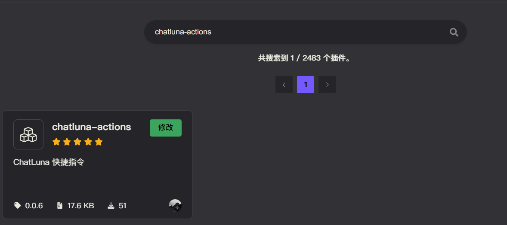

# 动作 (Action)

此插件可以自定义插件命令，传递指定的提示词给 ChatLuna 调用（从而实现自定义命令调用 llm）。并且可以拦截命令输出，调用 ChatLuna 来进行文字二次渲染。

## 配置

* 前往插件市场搜索 `chatluna-actions` 并安装。

完成完成后直接启用插件即可。

## 使用

参考下面的插件配置，配置插件即可。

配置完成后记得启用插件，才能选择模型。

## 配置项

此处列举了 `chatluna-actions` 插件的配置项。

### 命令配置

#### command

* 类型：`string`
* 默认值：无
* 描述：注册的一级命令名称

#### model

* 类型：`string`
* 默认值：无
* 描述：执行命令时使用的模型

#### enabled

* 类型：`boolean`
* 默认值：`false`
* 描述：是否启用此命令

#### description

* 类型：`string`
* 默认值：无
* 描述：命令的描述

#### chatMode

* 类型：`chat|plugin`

* 默认值：`chat`
* 描述：聊天模式（chat: 聊天模式, plugin: 插件模式）

#### promptType

* 类型：`Instruction|preset`
* 默认值：`Instruction`
* 描述：提示词类型（Instruction: 指令, preset: 预设）

#### preset

* 类型：`string`
* 默认值：无
* 描述：选择的预设

#### prompt

* 类型：`string`
* 默认值：无
* 描述：自定义提示词
* 说明：留空用户会自由输入，如设定不为空则使用设定值。

### 拦截命令配置

#### interceptCommands

* 类型：`string[]`
* 默认值：无
* 描述：拦截的命令列表

#### interceptPosition

* 类型：`string`
* 默认值：无
* 描述：拦截的位置（after: 命令执行后, before: 命令执行前）

#### interceptEnabled

* 类型：`boolean`
* 默认值：`false`
* 描述：是否启用此拦截命令配置

#### interceptModel

* 类型：`string`
* 默认值：无
* 描述：执行拦截命令时使用的模型

#### interceptCommand

* 类型：`string`
* 默认值：无
* 描述：拦截的命令名称

#### interceptChatMode

* 类型：`chat|plugin`
* 默认值：`chat`
* 描述：聊天模式（chat: 聊天模式, plugin: 插件模式）

#### interceptPromptType

* 类型：`Instruction|preset`
* 默认值：`Instruction`
* 描述：提示词类型（Instruction: 指令, preset: 预设）

#### interceptPreset

* 类型：`string`
* 默认值：无
* 描述：选择的预设

#### interceptPrompt

* 类型：`string`
* 默认值：无
* 描述：自定义提示词
* 说明：拦截命令输入文本
