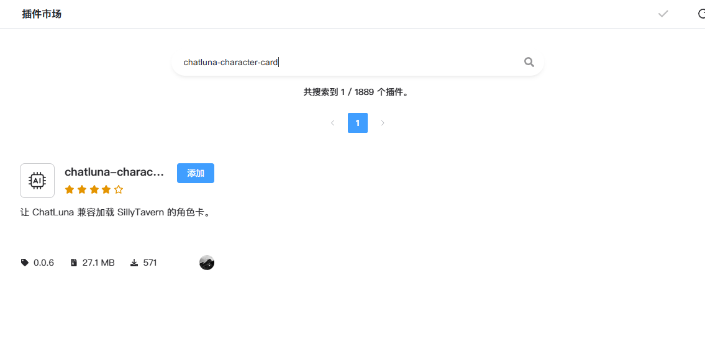

# 角色卡兼容 (Character Card)

此插件可以让 ChatLuna 兼容加载 SillyTavern 的角色卡。

> [!WARNING] 警告
> 此插件不保证兼容所有的角色卡。使用后的模型生成的效果也不保证和酒馆一致。

## 配置

- 前往插件市场搜索 `chatluna-character-card` 并安装。

完成完成后直接启用插件即可。

## 使用

将 SillyTavern 的角色卡文件放置在 `<koishi 数据目录>/data/chathub/sillytavern` 目录下，即可在 ChatLuna 中使用。

角色卡支持 `.json` 和 `.png` 格式。

放入后即可在 ChatLuna 中使用。关于切换预设，请参考 [预设切换](../../guide/preset-system/switch-preset.md)。

## 配置项

此处列举了 `chatluna-character-card` 插件的配置项。

### 基础配置

#### loadMode

- 类型：`memory|file`
- 默认值：`memory`

加载角色卡的模式。

- 选择为 `memory` 时，角色卡会被加载到内存中，可以进行动态加载。

- 选择为 `file` 时，角色卡会被转换为 ChatLuna 的预设文件，并存储在 `<koishi 数据目录>/data/chathub/preset` 目录下。
  
  需要重启 ChatLuna 才能加载最新转换的角色卡。

#### jailbreak

- 类型：`boolean`
- 默认值：`false`

是否启用越狱模式。

开启后，将会插入下面 Prompt 配置中的越狱 Prompt。

### Prompt 配置

> [!WARNING] 警告
> 此配置中的 Prompt 将严重影响到角色卡的最终回复质量。请根据使用模型的不同修改为最好效果的 Prompt。

#### systemMainPrompt

- 类型：`string`
- 默认值：`"...“`

主要的系统 Prompt。

#### personalityPrompt

- 类型：`string`
- 默认值：`"{{char}}'s personality: {{personality}}"`

角色的个性 Prompt。

#### scenarioPrompt

- 类型：`string`
- 默认值：`"{{char}}'s scenario: {{scenario}}"`

角色的场景 Prompt。

#### jailbreakPrompt

- 类型：`string`
- 默认值：`"...“`

越狱 Prompt。
