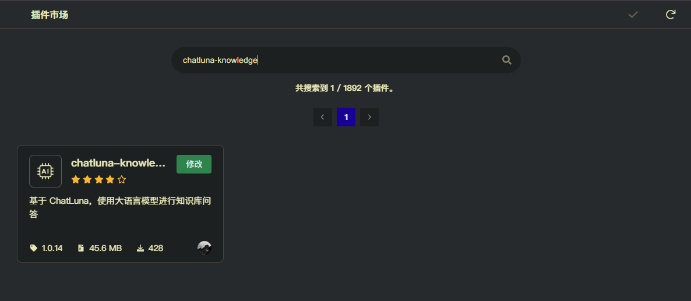
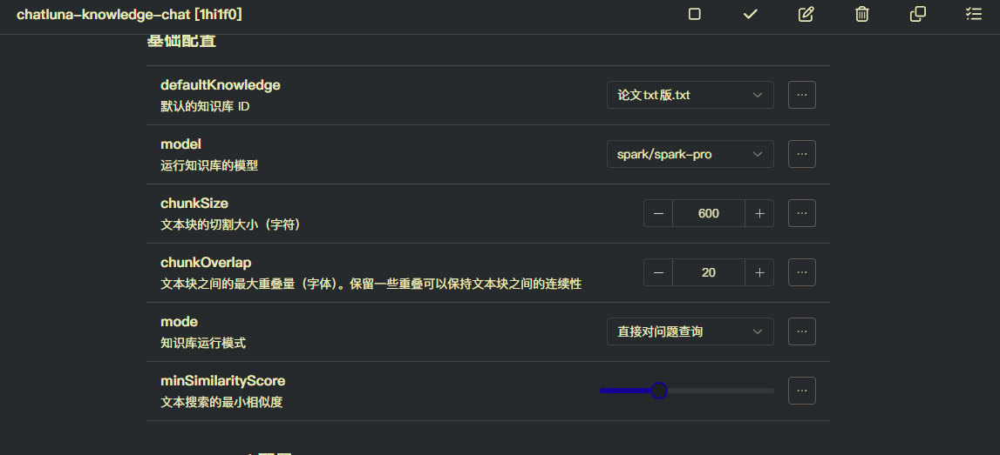

# 知识库 (Knowledge)

此插件为 ChatLuna 提供知识库能力。

> [! WARNING] 警告
> 此插件不支持 `plugin` 模式。如需在 `plugin` 模式下使用，请使用 [基础工具合集](../plugin/common.md#knowledge) 里的 `knowledge` 工具。

## 配置

* 前往插件市场，安装 `chatluna-knowledge` 插件。



* 确保和长期记忆的前置操作一致，配置了 [嵌入模型](../../guide/configure-embedding-model/introduction.md) 和 [向量存储](../../guide/configure-vector-database/introduction.md)。

* 启用插件。

## 使用

参考下面的命令 [添加知识库文档](#添加知识库文档)，添加一个文档到知识库中。

添加完成后选择你的默认知识库，在聊天模式或浏览模式下即可使用知识库能力。



对于插件模式，需要填写 [基础工具合集](../plugin/common.md#knowledgeid) 里的 ID。

> [! TIP] 提示
> 如果你使用的是聊天模式或者浏览模式，可在预设中设置使用的知识库，支持设置多个知识库 ID。
> 请参考 [预设](../../guide/preset-system/write-preset.md#知识库)。

## 命令

### 添加知识库文档

添加一个文档到知识库中。

> [! WARNING] 警告
> 目前支持直接解析 `txt` 、 `md` 、 `json` 、 `csv` 和部分纯文本代码格式的文件。
> 如需解析 `pdf` 、 `docx` 等文件，请查看插件的说明安装额外的依赖。
> 安装额外的依赖可能会导致你的 Koishi 实例出现无法更新，安装，卸载任何依赖的情况！！！
> 请在确认你有自行修复 Koishi 实例的能力后再进行操作。
> 或使用 [unstructured](https://github.com/Unstructured-IO/unstructured)，此方式较为安全。

以下为命令格式：

```powershell
chatluna.knowledge.upload <documentPath:string>
```

以下为参数说明：

* `documentPath`: 文档的路径。

以下为例子：

<chat-panel>
  <chat-message nickname="User">chatluna.knowledge.upload C:\Users\dingyi\Downloads\论文txt版.txt</chat-message>
  <chat-message nickname="Bot">已对 C:\Users\dingyi\Downloads\论文txt版.txt 解析成 17 个文档块。正在保存至数据库</chat-message>
  <chat-message nickname="Bot">已成功上传到 faiss 向量数据库</chat-message>
</chat-panel>

### 删除知识库文档

删除一个文档。

以下为命令格式：

```powershell
chatluna.knowledge.delete <documentPath:string>
```

以下为参数说明：

* `documentPath`: 文档添加时的路径。

以下为例子：

<chat-panel>
  <chat-message nickname="User">chatluna.knowledge.delete C:\Users\dingyi\Downloads\论文txt版.txt</chat-message>
  <chat-message nickname="Bot">正在从数据库中删除 C:\Users\dingyi\Downloads\论文txt版.txt，是否确认删除？回复大写 Y 以确认删除</chat-message>
  <chat-message nickname="User">Y</chat-message>
  <chat-message nickname="Bot">已成功删除文档 C:\Users\dingyi\Downloads\论文txt版.txt</chat-message>
</chat-panel>

### 列出知识库文档

列出当前知识库中的所有文档。

> [! TIP] 提示
> 此命令的输出格式为 `[id] => [documentPath]` 。
> 如需在基础工具合集里使用，填写左边的 id 即可。

以下为命令格式：

```powershell
chatluna.knowledge.list -v <vectorStore:string>
```

以下为参数说明：

* `-v,--vectorStore`: 指定向量存储的数据库名称。

以下为例子：

<chat-panel>
  <chat-message nickname="User">chatluna.knowledge.list </chat-message>
  <chat-message nickname="Bot">以下是你目前所有已经上传的文档<br>测试文档.txt => C:\Users\dingyi\Downloads\测试文档.txt<br>论文txt版.txt => C:\Users\dingyi\Downloads\论文txt版.txt<br>你可以使用 chatluna.knowledge.set 来切换当前环境里你使用的文档配置（文档配置不是文档）<br>第 1 / 1 页</chat-message>
</chat-panel>

### 从默认文件夹上传文档

从 `<koishi 数据目录>/data/chathub/knowledge/default` 文件夹中上传所有文档到知识库。

以下为命令格式：

```powershell
chatluna.knowledge.upload
```

以下为例子：

<chat-panel>
  <chat-message nickname="User">chatluna.knowledge.upload</chat-message>
  <chat-message nickname="Bot">已对 C:\Users\dingyi\data\chathub\knowledge\default\测试文档.txt 解析成 1 个文档块。正在保存至数据库</chat-message>
  <chat-message nickname="Bot">已成功上传到 faiss 向量数据库</chat-message>
  <chat-message nickname="Bot">已成功上传 1 / 1 个文档到 faiss 向量数据库</chat-message>
</chat-panel>

## 配置项

此处列举了插件的配置项。

### 基础配置

#### defaultKnowledge

* 类型：`string`
* 默认值：`无`

默认使用的知识库。

#### model

* 类型：`string`
* 默认值：`无`

默认知识库使用的模型。建议使用便宜速度快的模型。

#### chunkSize

* 类型：`number`
* 默认值：`500`

文档块的切割大小。切分越大，块包含的信息越多，越吃上下文。

#### chunkOverlap

* 类型：`number`
* 默认值：`100`

文档块的切割重叠大小。重叠越大，块之间的关联性越强。

#### mode

* 类型：`直接对问题查询|重新生成上下文查询|上下文压缩查询`
* 默认值：`直接对问题查询`

知识库的运行模式。

* `直接对问题查询`: 基于用户输入的问题直接查询知识库。
* `重新生成上下文查询`: 记忆用户的上下文，重新生成新问题。提高输入问题的关联性。
* `上下文压缩查询`: 压缩上下文查询。

#### minSimilarityScore

* 类型：`number`
* 默认值：`0.5`
* 范围：`0-1`

知识库查询的最小相似度。

#### topK

* 类型：`number`
* 默认值：`30`
* 范围：`1-50`

知识库查询的返回结果数量。

### unstructured 配置

用于配置 unstructured API。能支持更多的文件格式读取。

#### unstructuredApiEndpoint

* 类型：`string`
* 默认值：`http://localhost:8000`

unstructured API 的地址。

#### unstructuredApiKey

* 类型：`string`
* 默认值：`无`

unstructured API 的 key。
