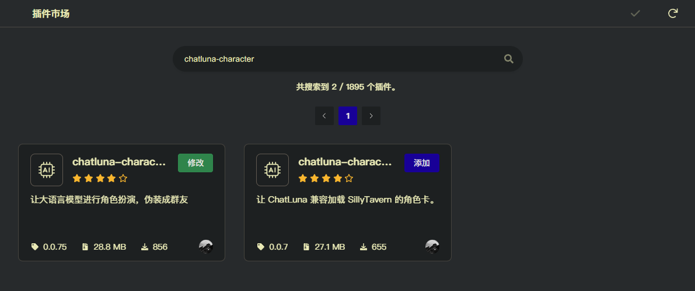

# 伪装群友 (Character) <Badge type="warning" text="实验性插件" />

此插件基于 Prompt 工程，尝试让大语言模型在群内伪装成群友对话。

此插件仍处于实验性阶段，若预设不够完善或使用的模型能力不足，「AI 味」可能还过浓。不要将其直接放入大群中。

## 配置

* 前往插件市场，安装 `chatluna-character` 插件。



## 使用

完成后启用插件。在基础配置中填写 [应用群组](#applygroup) 或 [应用私聊](#applyprivate)，再到全局私聊配置或全局群聊配置里选择对应模型。

此时即可和尝试和伪装对话。如果正常回复了，则说明配置成功。

如果你需要新增或修改预设，默认预设的文件夹位于 `<koishi-data-path>/chathub/character/presets` 。

## 预设

伪装的预设相比 ChatLuna 的预设，减少了很多自定义选项。下面是一个预设例子，其开头的注释部分也提供了基本配置指引：

::: details default.yml
<<< ../../public/resources/character_preset.yml
:::

当前默认预设是一个「模板预设」，包含较多注释和占位符（具体见开头的注释）。使用前请先按你的群环境替换这些内容。

整个预设被分为 `name`、`nick_name`、`input`、`system`、`status`、`mute_keyword` 六个核心字段。

让我们一步步来理解这些配置项。

### status

status 即为角色的状态，包括心情、状态、记忆、动作。
在预设的 `status` 中，只是初始的角色状态，具体状态的填充和生成，还需要 `input` 中进行。

### mute_keyword

`mute_keyword` 为禁用词。如果用户发送的消息中包含这些关键词，并且当前会话配置启用了 `isForceMute`，则会触发闭嘴。在群内不再响应，持续时间由 `muteTime` 决定。

### name

`name` 指定预设名称。它会出现在各级会话配置的 `preset` 下拉框中。

### nick_name

`nick_name` 为角色的昵称列表。开启 `isNickname` 后，当用户输入开头匹配到其中任意一个昵称时，会触发伪装回复。

### system

system 是整个预设的核心部分。在默认预设中，基于 Markdown 格式分成了几个板块：

* 基本设定 / 详细设定：
  角色身份、背景信息、边界与行为基线。

* 发言风格 / 特定情境应对指南：
  回复风格、常见场景处理、主动触发策略（如 `next_reply`、`wake_up_reply`）等。

* 消息格式与交互规范：
  回复长度、分句规则、是否使用 Markdown、表情/语音/引用等约束。

* 工具使用指南：
  如长期记忆、禁言、撤回等工具的调用策略与限制。

* 角色资料补充区：
  如群友信息、共同特点、名词解释、`<status></status>` 格式定义等。

目前伪装使用类 XML 格式来表达消息，一条标准消息如下：

```xml
  <message>content</message>
  ```

支持 AT 的示例如下（但不建议开启 AT ，容易造成困扰）：

```xml
  <message> <at name='name'>id</at> content </message>
  ```

另外也支持如下标签：

```xml
<message><voice>语音内容</voice></message>
  ```

```xml
<message><face name='name'>face_id</face></message>
  ```

```xml
<message><sticker>图片链接（单独发送图片）</sticker>文本内容</message>
  ```

```xml
<message>图片链接（图文在同一条消息中发送）</img>文本内容</message>
  ```

在部分时候需要让角色不回复，则可以输出空消息。

例如：

```xml
  <message></message>
  ```

具体规则以预设中“消息格式与交互规范”的要求为准。

你也可以自定义 `system` 内容，但请确保模型输出仍遵循可解析的消息格式。

### input

input 会把最近群聊的聊天记录和状态等信息作为格式化输入，基于此处的内容，让模型生成回复。

大体也可以分为几个板块：

* 背景信息：

  此处可插入 `{time}`、`{trigger_reason}`。

* 消息历史：

  此处可插入 `{history_new}`（最近消息）、`{history_last}`（最后一条消息）。

* 当前状态：

  此处可插入 `{status}` 来引用角色当前状态。

* 长期记忆：

  可插入 `{long_memory('guild')}` 以纯文本形式全量注入群组长期记忆。

* 生成格式：

  当前模板要求模型按以下结构输出（包含空行）：

```xml
  <status>
  更新后的状态
  </status>

  <think>
  角色视角的思考过程
  </think>

  <action>
  本次要进行的操作
  </action>

  <output>
  <message>消息1</message>
  <message>消息2</message>
  </output>
  ```

  遵循上面的标准格式，伪装才能正常解析模型的回复。

## 配置项

当前版本已经改为“基础配置 + 全局私聊配置 + 全局群聊配置 + 分会话覆盖”的结构，不再使用早期的顶层 `model`、`defaultPreset`、`modelOverride`、`privateModelOverride` 等旧字段。

### 基础配置

#### privateWhitelistMode

* 类型: `boolean`
* 默认值: `true`

是否启用私聊白名单模式。开启后，仅 `applyPrivate` 中列出的用户可以使用伪装插件。

#### applyPrivate

* 类型: `string[]`
* 默认值: `[]`

应用到的私聊用户 ID 列表。

#### groupWhitelistMode

* 类型: `boolean`
* 默认值: `true`

是否启用群聊白名单模式。开启后，仅 `applyGroup` 中列出的群组会启用伪装插件。

#### applyGroup

* 类型: `string[]`
* 默认值: `[]`

应用到的群组 ID 列表。

#### disableChatLuna

* 类型: `boolean`
* 默认值: `true`

在使用此插件的会话里，是否禁用 ChatLuna 主功能。

不建议关闭此选项，否则可能出现 ChatLuna 与伪装同时回复。

#### whiteListDisableChatLunaPrivate

* 类型: `string[]`
* 默认值: `[]`

启用伪装插件时，仍然保留 ChatLuna 主功能的私聊用户 ID 列表。

#### whiteListDisableChatLuna

* 类型: `string[]`
* 默认值: `[]`

启用伪装插件时，仍然保留 ChatLuna 主功能的群聊 ID 列表。

### 全局私聊配置

`globalPrivateConfig` 用于定义所有私聊默认配置，分私聊配置会在此基础上覆盖。

#### globalPrivateConfig.preset

* 类型: `string`
* 默认值: `CHARACTER`

使用的伪装预设。

#### globalPrivateConfig.model

* 类型: `string`
* 默认值: `''`

使用的模型。

#### globalPrivateConfig.enableFixedIntervalTrigger

* 类型: `boolean`
* 默认值: `true`

是否启用固定间隔触发。关闭后，不会再按 `messageInterval` 或 `messageWaitTime` 自动聚合触发。

#### globalPrivateConfig.messageInterval

* 类型: `number`
* 默认值: `0`
* 范围: `0-10000`

固定间隔触发的消息间隔（条）。私聊设为 `0` 时，会改为使用 `messageWaitTime` 做聚合触发，而不是每条消息立刻请求。

#### globalPrivateConfig.messageWaitTime

* 类型: `number`
* 默认值: `10`
* 范围: `0-300`

发言等待时长（秒）。仅在 `enableFixedIntervalTrigger = true` 且 `messageInterval = 0` 时生效，用于在收到消息后等待用户把多条连续消息发完。

#### globalPrivateConfig.idleTrigger

私聊的空闲触发配置，包含以下字段：

* `enableLongWaitTrigger`：是否启用空闲触发，默认 `false`
* `idleTriggerIntervalMinutes`：空闲触发间隔，默认 `480`
* `idleTriggerRetryStyle`：重试风格，`'exponential' | 'fixed'`，默认 `'exponential'`
* `idleTriggerMaxIntervalMinutes`：指数退避最大间隔，默认 `1440`
* `idleTriggerFixedMaxRetries`：固定重试最大连续次数，默认 `3`
* `enableIdleTriggerJitter`：是否启用 5%-10% 随机抖动，默认 `true`

#### globalPrivateConfig 其余通用字段

以下字段也存在于 `globalPrivateConfig` 中：

* `maxMessages`：存储在内存里的最大消息数量，默认 `40`，范围 `3-100`
* `modelCompletionCount`：模型历史消息轮数，默认 `1`，范围 `0-6`
* `maxTokens`：聊天的最大 token 数，默认 `20000`，范围 `1024-20000`
* `enableMessageId`：向模型暴露平台消息 ID，以允许发送引用消息，默认 `true`
* `statusPersistence`：是否将状态变量持久化到数据库，默认 `true`
* `historyPull`：是否在缺失历史消息时自动拉取历史消息，默认 `true`
* `toolCalling`：是否启用工具调用功能，默认 `true`
* `image`：是否允许输入图片，默认 `false`
* `imageInputMaxCount`：最大输入图片数量，默认 `9`，范围 `1-15`
* `imageInputMaxSize`：最大输入图片大小（MB），默认 `20`，范围 `1-100`
* `multimodalFileInputMaxSize`：最大多模态文件输入大小（MB），默认 `20`，范围 `1-100`
* `splitVoice`：是否分段发送语音，默认 `false`
* `isNickname`：允许 bot 配置中的昵称引发回复，默认 `true`
* `isNickNameWithContent`：是否允许在内容里任意匹配昵称触发对话，默认 `false`
* `isForceMute`：是否启用关键词触发闭嘴，默认 `false`
* `coolDownTime`：冷却发言时间（秒），默认 `0`
* `typingTime`：模拟打字时每个字的输入时长（毫秒），默认 `200`，范围 `100-1700`
* `largeTextSize`：大文本消息判断阈值，默认 `100`，范围 `100-1000`
* `largeTextTypingTime`：大文本消息每个字的输入时长（毫秒），默认 `10`，范围 `10-1500`
* `muteTime`：关键词触发闭嘴时的沉默时长（秒），默认 `60`

### 全局群聊配置

`globalGroupConfig` 用于定义所有群聊默认配置，分群配置会在此基础上覆盖。

#### globalGroupConfig.preset

* 类型: `string`
* 默认值: `CHARACTER`

使用的伪装预设。

#### globalGroupConfig.model

* 类型: `string`
* 默认值: `''`

使用的模型。

#### globalGroupConfig.enableFixedIntervalTrigger

* 类型: `boolean`
* 默认值: `true`

是否启用固定间隔触发。关闭后，不会再按 `messageInterval` 自动触发。

#### globalGroupConfig.messageInterval

* 类型: `number`
* 默认值: `20`
* 范围: `0-10000`

固定间隔触发的消息间隔（条）。累计到该条数后自动触发一次；设为 `0` 时，每一条消息都会触发请求。

#### globalGroupConfig.idleTrigger

群聊的空闲触发配置，结构与私聊一致，但默认 `idleTriggerIntervalMinutes` 为 `180`。

#### globalGroupConfig.enableActivityScoreTrigger

* 类型: `boolean`
* 默认值: `true`

是否启用活跃度触发。开启后，会结合近期消息节奏与活跃度阈值决定是否自动回复。

#### globalGroupConfig.messageActivityScoreLowerLimit

* 类型: `number`
* 默认值: `0.85`
* 范围: `0-1`
* 步进: `0.00001`

消息活跃度分数下限阈值。初始状态或长时间无人回复后，会使用此阈值判断是否响应。

#### globalGroupConfig.messageActivityScoreUpperLimit

* 类型: `number`
* 默认值: `0.85`
* 范围: `0-1`
* 步进: `0.00001`

消息活跃度分数上限阈值。每次响应后，判断阈值会向此值靠拢；若下限小于上限，会越聊越少；反之会越聊越多；十分钟内无人回复时会自动回退到下限。

#### globalGroupConfig.isAt

* 类型: `boolean`
* 默认值: `false`

是否启用 `@`。

#### globalGroupConfig 其余通用字段

除 `messageActivityScoreLowerLimit`、`messageActivityScoreUpperLimit`、`isAt` 外，其余字段与 `globalPrivateConfig` 的同名字段含义一致。

### 分私聊配置

#### privateConfigs

* 类型: `Record<string, PrivateConfig>`
* 默认值: `{}`

分私聊配置，会覆盖 `globalPrivateConfig` 中的同名字段，键填写私聊用户 ID。

每个私聊条目支持：

* `preset`
* `remark`（备注，无实际作用）
* `model`（默认值为 `无`，表示继承全局私聊配置）
* `enableFixedIntervalTrigger`
* `messageInterval`
* `messageWaitTime`
* `idleTrigger`
* `maxMessages`
* `modelCompletionCount`
* `maxTokens`
* `enableMessageId`
* `statusPersistence`
* `historyPull`
* `toolCalling`
* `image`
* `imageInputMaxCount`
* `imageInputMaxSize`
* `multimodalFileInputMaxSize`
* `splitVoice`
* `isNickname`
* `isNickNameWithContent`
* `isForceMute`
* `coolDownTime`
* `typingTime`
* `largeTextSize`
* `largeTextTypingTime`
* `muteTime`

### 分群聊配置

#### configs

* 类型: `Record<string, GuildConfig>`
* 默认值: `{}`

分群聊配置，会覆盖 `globalGroupConfig` 中的同名字段，键填写群号。

每个群聊条目支持 `privateConfigs` 的全部字段，另外额外支持：

* `enableActivityScoreTrigger`
* `isAt`
* `messageActivityScoreLowerLimit`
* `messageActivityScoreUpperLimit`
