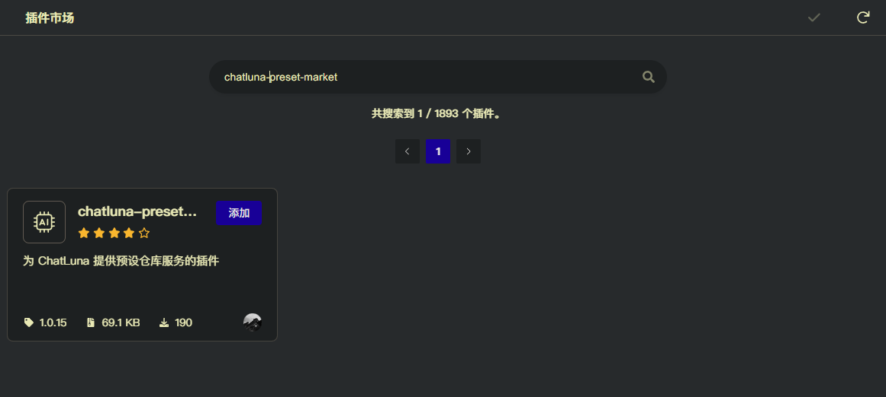

# 预设仓库 (Preset Market)

此插件提供了 ChatLuna 预设仓库的一站式下载，搜索服务。

ChatLuna 预设仓库地址：[https://github.com/ChatLunaLab/awesome-chatluna-presets](https://github.com/ChatLunaLab/awesome-chatluna-presets)

欢迎各位提交自己的预设到预设仓库，丰富 ChatLuna 的生态。

## 配置

前往插件市场，安装 `chatluna-preset-market` 插件。



启用插件即可。

## 使用

参考下面的 [下载预设](#下载预设) 命令，下载你心仪的预设到本地。
下载后参考 [切换预设](../../guide/preset-system/switch-preset.md)，切换到你下载的预设。

## 命令

### 下载预设

下载一个预设到本地。

以下为命令格式：

```powershell
chatluna.preset.download <presetName:string>
```

以下为参数说明：

- `presetName`: 预设的名称。

以下为例子：

<chat-panel>
  <chat-message nickname="User">chatluna.preset-market.download 小帅</chat-message>
  <chat-message nickname="Bot">下载预设 小帅 成功，快使用 chatluna.preset.list 查看吧</chat-message>
</chat-panel>

### 搜索预设

基于输入的关键词，搜索预设仓库中的预设。

以下为命令格式:

```powershell
chatluna.preset-market.search <query:string>
```

以下为参数说明:

- query: 关键词。

以下为例子:

<chat-panel>
  <chat-message nickname="User">chatluna.preset-market.search 小帅</chat-message>
  <chat-message nickname="Bot">以下是关于预设 小帅 的结果：</br>名称：小帅</br>关键词: 小帅</br>当前页数：(1/1)</chat-message>
</chat-panel>

### 列出预设

列出所有预设仓库可用的预设。

以下为命令格式：

```powershell
chatluna.preset-market.list -l <limit:number> -p <page:number>
```

以下为可选参数：

- `-l,--limit`: 指定返回预设的数量上限，默认为 3。
- `-p,--page`: 指定返回预设的页数，默认为 1。

以下为例子：

<chat-panel>
  <chat-message nickname="User">chatluna.preset-market.list -l 10</chat-message>
  <chat-message nickname="Bot">预设列表：<br>
  名称：2B<br>
  关键词: 2B<br>
  <br>
  名称：Altria<br>
  关键词: Altria ,阿尔托莉雅·潘德拉贡 ,呆毛王<br>
  <br>
  名称：dj<br>
  关键词: 丁真<br>
  <br>
  名称：jk学生<br>
  关键词: smart_jk ,jk学生<br>
  <br>
  名称：logier<br>
  关键词: logier<br>
  <br>
  名称：murasame_short<br>
  关键词: 丛雨 ,ムラサメ ,幼刀<br>
  <br>
  名称：tag<br>
  关键词: 猫娘<br>
  <br>
  名称：vanilla-cute<br>
  关键词: vanilla-cute ,香草卖萌版<br>
  <br>
  名称：专家咨询<br>
  关键词: 专家咨询<br>
  <br>
  名称：凯伊<br>
  关键词: 凯伊<br>
  <br>
  当前页数：(1/4) <br>
  </chat-message>
</chat-panel>

### 刷新预设

刷新预设仓库中的预设列表。

以下为命令格式：

```powershell
chatluna.preset-market.refresh
```

以下为例子：

<chat-panel>
  <chat-message nickname="User">chatluna.preset-market.refresh</chat-message>
  <chat-message nickname="Bot">刷新预设仓库成功，快使用 chatluna.preset.list 查看吧</chat-message>
</chat-panel>

### 上传预设

上传一个预设到预设仓库。

由于 ChatLuna 的预设仓库是基于 GitHub 的，我们无法直接上传预设，所以需要你手动上传。

上传后，请在 [预设仓库](https://github.com/ChatLunaLab/awesome-chatluna-presets) 中提交一个 Pull Request，我们会及时审核。

以下为命令格式：

```powershell
chatluna.preset-market.upload
```

以下为例子：

<chat-panel>
  <chat-message nickname="User">chatluna.preset-market.upload</chat-message>
  <chat-message nickname="Bot">非常抱歉，由于我们使用 GitHub 作为预设仓库，请有需要上传预设的用户前往此仓库提交 Pull Request: <a href="https://github.com/ChatHubLab/awesome-chathub-presets">https://github.com/ChatHubLab/awesome-chathub-presets</a></chat-message>
</chat-panel>

### 一键下载所有预设

一键下载所有预设到本地。

以下为命令格式：

```powershell
chatluna.preset-market.download-all
```

以下为例子：

<chat-panel>
  <chat-message nickname="User">chatluna.preset-market.download-all</chat-message>
  <chat-message nickname="Bot">以下操作将会覆盖你本地的所有预设，请先备份你本地的预设，是否继续？输入 Y 确认，否则取消。</chat-message>
  <chat-message nickname="User">Y</chat-message>
  <chat-message nickname="Bot">开始下载所有预设，总计 20 个预设。可在控制台查看下载进度。</chat-message>
  <chat-message nickname="Bot">下载预设完成，成功: 20, 失败: 0, 总数: 20</chat-message>
</chat-panel>
