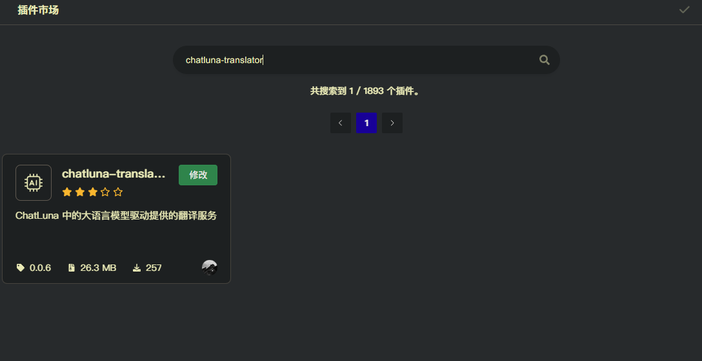

# 翻译服务 (Translator)

此插件实现了 Koishi 的 [翻译服务](https://translator.koishi.chat/) 能力。

## 配置

前往插件市场，安装 `chatluna-translator` 插件。

启用插件即可。

## 使用

启用插件后，配置 [模型](#model) 即可使用。

## 配置项

### model

- 类型: `string`
- 默认值: `"gpt-4o"`

指定翻译时使用的模型。

### prompt

- 类型: `string`
- 默认值: `...`

指定翻译时使用的提示词。

注意：

- 提示词里的 `{from}` 和 `{to}` 会被替换为翻译的源语言和目标语言。
- 提示词里的 `{text}` 会被替换为翻译的文本。
- 翻译的结果需要为 json 格式，如 `{"result": "..."}`。

请按照上述规则组织提示词。
