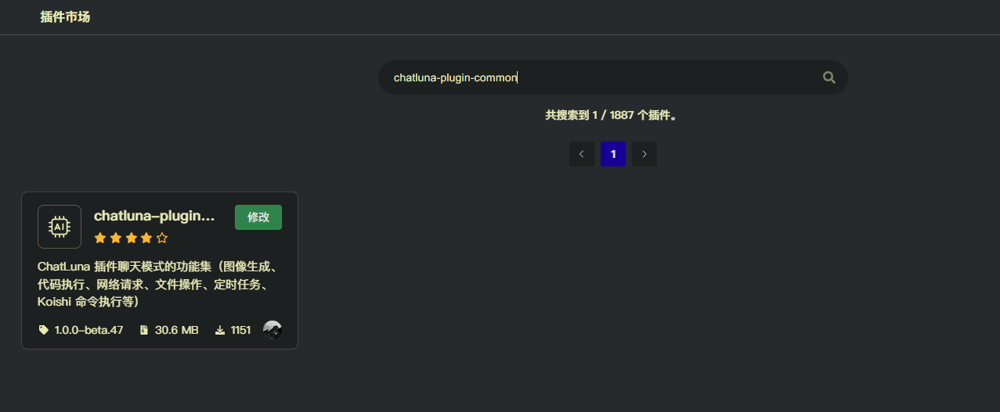

# 基础工具合集 (Plugin Common)

此插件为 ChatLuna 的 Agent 模式提供了一些基础的工具。

## 配置

- 前往插件市场搜索 `chatluna-plugin-common` 并安装。

## 使用

具体可启用工具和使用方法，请参考 [模型工具介绍](../../guide/model-plugin-system/introduction.md)。

## 配置项

此处列举了 `chatluna-plugin-common` 插件的配置项。

### 插件功能配置

#### request

- 类型：`boolean`
- 默认值：`false`

是否启用网络请求工具。开启后，模型可以调用 `request_get` 和 `request_post` 工具进行网络的 GET 和 POST 请求。

#### fs

- 类型：`boolean`
- 默认值：`false`

是否启用文件读写工具。开启后，模型可以调用 `file_write` 和 `file_read` 工具读写文件。

另外可以参考 [fs 插件配置](#fs) 配置文件读写的作用域。

#### group

- 类型：`boolean`
- 默认值：`false`

是否启用群组工具。开启后，模型可以禁言或者取消禁言指定用户。（需要当前用户有群内管理员权限，并且调用的用户也具备下面的管理员权限）

在 [群组管理](#群管插件配置) 下填写管理员账号。

#### command

- 类型：`boolean`
- 默认值：`false`

是否启用指令工具。开启后，模型可以根据 [指令配置](#指令插件配置) 配置的指令，执行对应的 Koishi 指令。

如果不在下面的 [指令插件配置](#指令插件配置) 中配置指令，则默认注册 Koishi 可用的全部指令。

#### chat

- 类型：`boolean`
- 默认值：`false`

是否启用聊天工具。开启后，模型可以调用 `chat` 工具。该工具会等待用户的输入，返回给模型。

#### think

- 类型：`boolean`
- 默认值：`false`

是否启用思考工具。开启后，模型可以调用 `think` 工具。该工具会基于模型输入的内容，调用其他模型进行思维链推理，返回推理结果。一定程度上提升模型输出的质量。

#### cron

- 类型：`boolean`
- 默认值：`false`

是否启用定时任务工具。开启后，模型可以调用 `cron` 工具。

#### send

- 类型：`boolean`
- 默认值：`false`

是否启用发送消息工具。开启后，模型可以调用 `send` 工具。该工具会发送消息给用户。

#### draw

- 类型：`boolean`
- 默认值：`false`

是否启用文生图工具。开启后，模型可以调用 `draw` 工具。该工具会基于模型输入的内容，调用 Koishi 上的文生图插件，生成图片。

另可参考 [文生图插件配置](#draw) 配置文生图工具。

#### codeSandbox

- 类型：`boolean`
- 默认值：`false`

是否启用代码执行工具。开启后，模型可以调用 `codeSandbox` 工具。该工具会基于模型输入的内容，执行 Python 代码。

参考 [代码执行器配置](#代码执行器配置) 配置代码执行工具所需的 API 密钥。

#### memory

- 类型：`boolean`
- 默认值：`false`

是否启用主动记忆工具。开启后，模型可以调用 `memory_save` 和 `memory_search` 工具，保存和搜索用户的记忆。

使用前需要确保主插件的长期记忆功能是否能正常启用，正确配置了向量数据库和嵌入模型。

#### knowledge

- 类型：`boolean`
- 默认值：`false`

是否启用知识库工具。开启后，模型可以调用 `knowledge` 工具，搜索知识库中的内容。

另可参考 [知识库插件配置](#knowledge) 配置知识库工具。

#### music

- 类型：`boolean`
- 默认值：`false`

是否启用音乐播放工具。开启后，模型可以调用 `music` 工具，播放音乐。

在启用此工具前，需要确保 Koishi 的 `@dgck81lnn/music` 插件已启用。

### fs 插件配置

#### fsScopePath

- 类型：`string`
- 默认值：``

文件读写的作用域。留空则为任意路径。

### 指令插件配置

#### commandList

- 类型：`{ command: string, description: string, selector: string[] }[]`
- 默认值：`[]`

需要注册的指令列表。

##### commandList.command

- 类型：`string`
- 默认值：``

需要执行的 Koishi 指令。

##### commandList.description

- 类型：`string`
- 默认值：``

指令的描述。此描述面向模型，用于模型理解指令的作用。

##### commandList.selector

- 类型：`string[]`
- 默认值：`[]`

指令的触发条件。当聊天内容包含这些关键词时，此指令才会注册给模型。

### 代码执行器配置

#### codeSandboxAPIKey

- 类型：`string`
- 默认值：``

代码执行工具所需的 API 密钥。密钥需要前往 [e2b](https://e2b.dev/) 获取。

### 群管插件配置

#### groupScopeSelector

- 类型：`string[]`
- 默认值：`[]`

群管理员账号列表。

### 画图插件配置

#### drawPrompt

- 类型：`string`
- 默认值：`1girl, solo, female only, full body, masterpiece, highly detailed, game CG, spring, cherry blossoms, floating sakura, beautiful sky, park, extremely delicate and beautiful girl, high school girl, black blazer jacket, plaid skirt, short_hair, blunt_bangs, white_hair/pink_eyes, two-tone hair, gradient hair, by Masaaki Sasamoto, best quality, masterpiece, highres, red-eyeshadow, lipstick.`

画图工具的参考 Prompt，用于给模型提供参考。建议只填写 70 词以内的高质量提示词。

#### drawCommand

- 类型：`string`
- 默认值：`nai {prompt}`

画图时实际执行的指令。

### 知识库插件配置

> [!WARNING] 警告
> 启用此工具前需要配置知识库插件，前往 [知识库插件文档](../extension/knowledge.md) 查看用法。

#### knowledgeId

- 类型：`string[]`
- 默认值：`[]`

知识库的 ID 列表。
