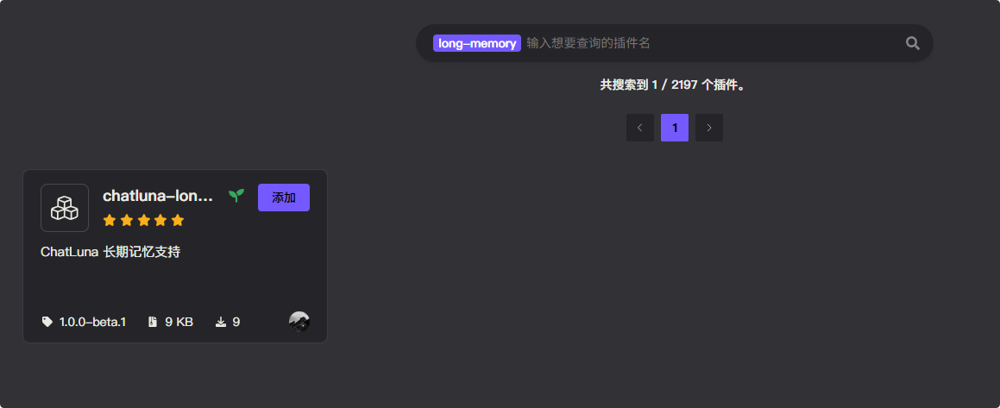

# 长期记忆 (Long Term Memory)

在最新版本中，我们将长期记忆拆分成了独立的插件，以便更好的扩展相关功能。

## 配置

* 前往插件市场搜索 `chatluna-long-memory` 并安装。



::: tip 提示
如果无法正常搜索到 `chatluna-long-memory`，则说明官方插件源没有正常更新。
前往 market 插件设置为其他源即可：


以下是推荐的一些插件源:

* [https://koishi-registry.yumetsuki.moe/index.json](https://koishi-registry.yumetsuki.moe/index.json)
* [https://kp.itzdrli.cc](https://kp.itzdrli.cc)

:::

## 使用

确保你已经配置好了 [嵌入模型](../configure-embedding-model/introduction.md) 和 [向量数据库](../configure-vector-database/introduction.md)。

配置完成后，前往 Koishi 控制面板，启用长期记忆插件即可。

开启后还需要设置长期记忆的 [提取模型](../useful-configurations.md#longmemoryextractmodel)。

长期记忆的被动提取基于大语言模型来提取关键信息，因此需要设置模型。

推荐使用速度快的模型，如 `gpt-4o-mini`。

对于 [长期记忆存储轮次](../useful-configurations.md#longmemoryinterval)，推荐设置为 3-5 轮次，可以保证记忆的准确性，也不会产生太多冗余记忆。

> [!TIP] 提示
> 长期记忆支持主动提取和被动提取。被动提取只根据轮次进行记忆获取。
>
> 主动提取则会向 ChatLuna 注册工具，让 Agent 判断是否需要添加记忆。此时可以不设置长期记忆的提取模型。

## 记忆引擎

长期记忆插件提供三种记忆引擎，各自使用不同的算法存储和检索记忆。

### Basic

Basic 引擎将全部记忆直接加入上下文，不进行过滤或排序。

它的特点在于：

1. 不需要引入任何其他调用，单纯的记忆文本。
2. 直接返回所有记忆，不进行任何筛选。
3. 记忆量很大时，可能会占用较多的上下文。

我们推荐在记忆量在小到中等的场景下应用。

### HippoRAG

HippoRAG 基于知识图谱和 Personalized PageRank (PPR) 算法。

从对话中提取实体和关系，构建知识图谱，通过图算法进行多跳推理和关联检索。

它的特点在于：

1. 构建知识图谱，使用 PPR 算法进行精确的搜索
2. 实体别名支持合并与桥接，增强关联性。
3. 支持更大量的数据存储，不会占用过多的上下文。

我们推荐在记忆量中到大的场景下应用。

### EMGAS

EMGAS (Episodic Memory Graph with Activation Spreading) 基于激活扩散算法。

通过概念节点和话题节点构建记忆图谱，使用激活扩散算法进行联想检索。

它的特点在于：

1. 轻量级的图谱结构，低于 HippoRAG 构建的架构
2. 计算成本低于 HippoRAG
3. 内置时间衰减机制和记忆强化，并支持增量式构建。

我们推荐在记忆量中到大的场景下应用。

## 记忆分层

长期记忆使用分层的架构存储，不同层级有不同的共享范围。

每个分层都可以使用不同的长期记忆引擎驱动存储。

### Global

全局层在所有用户和会话间共享。

一般在通用知识库，系统规则，公共信息下使用。

### Preset

预设层在使用相同预设的对话间共享，不同预设间隔离。

一般在角色设定，预设背景信息，角色人格下使用。

### Guild

群组层在同一群组内的用户间共享。

一般用于群聊话题，群成员信息，群组事件的存储。

### User

用户层按用户隔离，但在同一用户的所有对话间共享。这也是最主要的记忆层。

一般用于用户的个人信息，用户的对话历史或者用户的个性化记忆。

### 检索机制

检索时按配置的层级列表依次检索并合并结果。

默认情况下通过 `enabledLayers` 选择启用的层级。
通过 `layerEngines` 为不同层级配置引擎。

## 渲染模板函数

模板函数 `longMemory` 支持在 ChatLuna 预设（主插件/伪装）中使用。

适用于非主插件下，需要检索记忆的场景。

阅读 [渲染模板](../../guide/preset-system/template.md) 以了解渲染模板的使用。

下面是语法：

```js
{long_memory(...query_layers: string[])}
```

例如：

```js
{long_memory('global', 'guild', 'user')}
```

会查询当前对话者全局层，群组层，用户层的记忆。

你只需要选择合适的位置插入到预设上下文中即可。

## 配置项

### 基础配置

#### enabledLayers

* 类型: `('Global' | 'Preset' | 'Guild' | 'User')[]`
* 默认值: `['Global', 'Guild', 'User']`

启用的记忆检索层。可以选择启用哪些层级的记忆。

#### layerEngines

* 类型: `{ layer: 'Global' | 'Preset' | 'Guild' | 'User', engine: 'Basic' | 'HippoRAG' | 'Emgas' }[]`
* 默认值:

  ```json
  [
    { "layer": "User", "engine": "HippoRAG" },
    { "layer": "Global", "engine": "Basic" },
    { "layer": "Guild", "engine": "HippoRAG" },
    { "layer": "Preset", "engine": "HippoRAG" }
  ]
  ```

记忆检索层引擎列表。决定不同的记忆检索层使用的长期记忆引擎。

##### layerEngines.layer

检索层类型，可选值:

* `Global`: 全局层
* `Preset`: 预设层
* `Guild`: 群组层
* `User`: 用户层

##### layerEngines.engine

长期记忆引擎配置，可选值:

* `Basic`: 基础引擎，纯文本叠加使用的记忆引擎，会将全部记忆加入到上下文中
* `HippoRAG`: HippoRAG 引擎，基于 HippoRAG 的长期记忆引擎
* `Emgas`: EMGAS 引擎，基于 EMGAS 的长期记忆引擎

#### longMemoryExtractModel

* 类型: `string`
* 默认值: `无`

长期记忆自动分析提取记忆的模型。

#### longMemoryExtractInterval

* 类型: `number`
* 默认值: `3`
* 范围: `1-10`

自动记忆抽取的轮次间隔，每 N 轮对话进行一次记忆抽取。

#### longMemoryQueryRewrite

* 类型: `boolean`
* 默认值: `true`

是否启用查询改写。开启后在搜索长期记忆前由模型生成更合适的查询。

### HippoRAG 引擎配置

#### hippoSimilarityThreshold

* 类型: `number`
* 默认值: `0.35`
* 范围: `0-1`，步进 `0.01`

最终综合得分阈值。越高越严格，只有相似度超过此值的记忆才会被检索。

#### hippoPPRAlpha

* 类型: `number`
* 默认值: `0.15`
* 范围: `0-1`，步进 `0.01`

PPR (Personalized PageRank) 随机游走参数 alpha。控制随机游走时的跳转概率。

#### hippoTopEntities

* 类型: `number`
* 默认值: `10`
* 范围: `1-50`

PPR 选择的高分实体数量，用于候选扩展。

#### hippoMaxCandidates

* 类型: `number`
* 默认值: `200`
* 范围: `10-2000`，步进 `10`

PPR 产生的候选记忆上限。

#### hippoHybridWeight

* 类型: `number`
* 默认值: `0.8`
* 范围: `0-1`，步进 `0.01`

混合重排权重。这是语义相似度的占比，剩余部分为 PPR 分数。`0.8` 表示更偏向语义与指纹的鲁棒性。

#### hippoIEEnabled

* 类型: `boolean`
* 默认值: `true`

是否启用三元组抽取。开启后会从记忆中抽取实体关系三元组，构建更丰富的关系边，强化知识图谱。

#### hippoBridgeThreshold

* 类型: `number`
* 默认值: `0.6`
* 范围: `0-1`，步进 `0.01`

实体桥接阈值。使用字符 Shingle Jaccard 相似度，相似实体间会自动添加连接边。

#### hippoReinforceTopK

* 类型: `number`
* 默认值: `10`
* 范围: `1-100`

每次仅对前 K 条命中记忆进行"使用即强化"，减少写放大。

#### hippoAliasThreshold

* 类型: `number`
* 默认值: `0.85`
* 范围: `0-1`，步进 `0.01`

实体别名合并阈值。使用字符 Shingle Jaccard 相似度，相似度达到或超过此值的实体会被合并为同一实体。

#### hippoKGPersist

* 类型: `boolean`
* 默认值: `true`

是否持久化知识图谱至磁盘。开启后重启无需重建知识图谱。

#### hippoExtractModel

* 类型: `string`
* 默认值: `无`

用于记忆抽取和查询改写的模型。选择较快的模型可提高吞吐量。

### EMGAS 引擎配置

#### emgasExtractModel

* 类型: `string`
* 默认值: `无`

用于从记忆内容中提取概念和主题的模型。

#### emgasDecayRate

* 类型: `number`
* 默认值: `0.01`
* 范围: `0.001-0.1`，步进 `0.001`

时间衰减 Lambda (λ)。控制记忆背景性遗忘的速率。较高的值使记忆遗忘更快，影响节点的基础激活值，从而间接影响其在检索中被激活的潜力。

#### emgasPruneThreshold

* 类型: `number`
* 默认值: `0.05`
* 范围: `0.001-0.5`，步进 `0.001`

低激活节点的修剪阈值。激活度低于此值的节点会从记忆图中移除，用于维护图的整洁性和检索效率。

#### emgasFiringThreshold

* 类型: `number`
* 默认值: `0.1`
* 范围: `0.01-1.0`，步进 `0.01`

点火阈值 (F)。节点传播其能量所需的最小激活值。较高的值导致更集中、探索性较弱的搜索；较低的值则允许更广泛、更远的联想。

#### emgasPropagationDecay

* 类型: `number`
* 默认值: `0.85`
* 范围: `0.1-1.0`，步进 `0.01`

传播衰减 (D)。能量在每跳传播中损失的比例。较高的衰减值（接近 1.0）将搜索限制在种子节点的近邻；较低的衰减值（接近 0.0）允许激活传播到更远的节点。

#### emgasMaxIterations

* 类型: `number`
* 默认值: `5`
* 范围: `1-20`

最大迭代次数。强制终止扩散过程的硬性限制，直接控制检索延迟。较少的迭代次数返回更直接的关联，更多的迭代次数则能发现更深层次的间接关联。

#### emgasTopN

* 类型: `number`
* 默认值: `20`
* 范围: `5-100`

从图中检索的候选记忆数量上限。控制返回结果的数量，平衡记忆覆盖度和处理效率。
