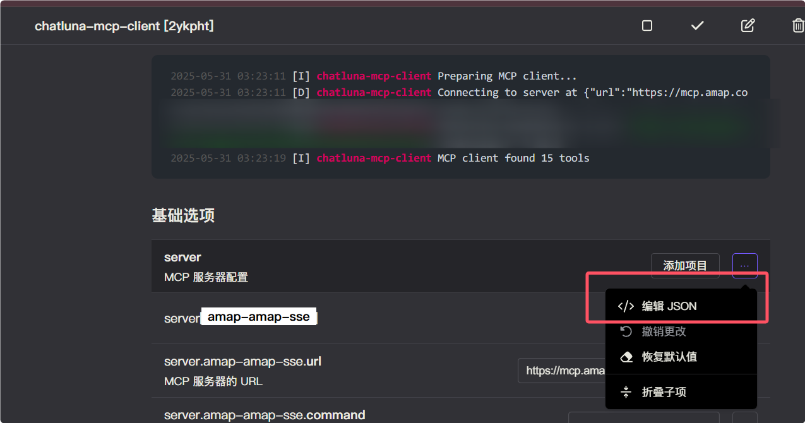
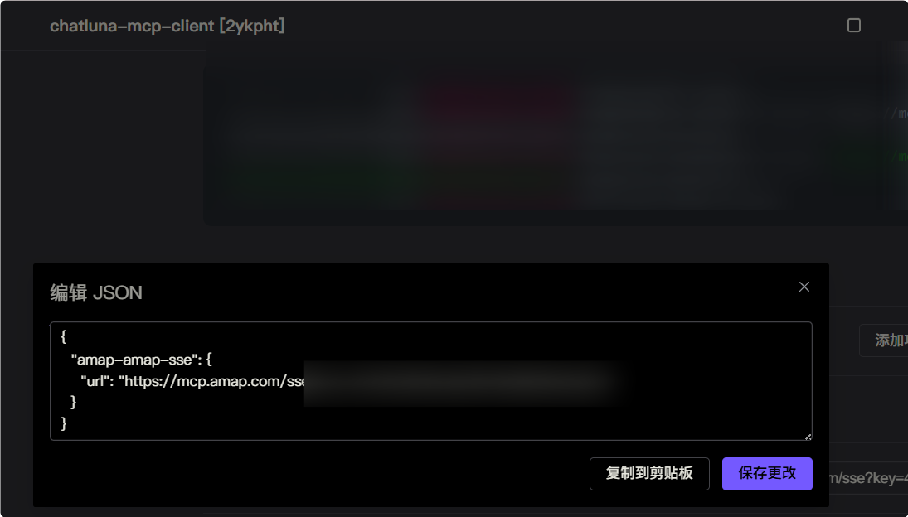

# MCP 协议客户端 （MCP Client）

MCP 协议是 Model Context Protocol 的缩写，是 LangChain 提供的一种协议，用于在不同的模型之间传递上下文。

此插件为 ChatLuna 的 Agent 模式提供了 MCP 协议支持。

## 配置

* 前往插件市场搜索 `chatluna-mcp-client` 并安装。


::: tip 提示
如果无法正常搜索到 `chatluna-mcp-client`，则说明官方插件源没有正常更新。
前往 market 插件设置为其他源即可：


以下是推荐的一些插件源：

- [https://koishi-registry.yumetsuki.moe/index.json](https://koishi-registry.yumetsuki.moe/index.json)
- [https://kp.itzdrli.cc](https://kp.itzdrli.cc)

:::

安装后启用插件即可。

## 使用

> [!TIP]
> 启用此插件时，请确保你当前聊天房间的聊天模式为 `plugin`  Agent 模式。
> 可以查看 [聊天模式](../../guide/chat-chain/chat-mode.md) 了解如何切换聊天模式。

你需要在 `chatluna-mcp-client` 插件的配置中设置 `servers` 选项，来指定你想要连接的 MCP 服务器。

启用插件后，按照下图去编辑 JSON 来配置需要连接到的 MCP 服务器：





这里的参数基本和 `Claude Desktop` 和 `Cursor` 的 `mcpServers` 参数一致。

如 `Claude Desktop` 的一个配置如下：

```json
{
  "mcpServers": {
    "exa": {
      "command": "npx",
      "args": ["/path/to/exa-mcp-server/build/index.js"],
      "env": {
        "EXA_API_KEY": "your-api-key-here"
      }
    }
  }
}
```

转换为下面的格式，编辑到 `chatluna-mcp-client` 插件的 `server` 配置中即可。

```json
{
    "exa": {
      "command": "npx",
      "args": ["/path/to/exa-mcp-server/build/index.js"],
      "env": {
        "EXA_API_KEY": "your-api-key-here"
      }
    }
}
```

完成后重载插件，如果成功，则会在日志中看到如下信息（会列出可用的工具数目）：


> [!TIP]
> 请确保你的环境下支持可执行文件的运行。如果不存在，请安装对应的依赖。

## 配置项

此处列举了 `chatluna-mcp-client` 插件的配置项。

### servers

* 类型：`object`
* 默认值：`{}`

MCP 服务器配置。此配置项用于定义需要连接的 MCP 服务器。每个服务器以键值对的形式配置，键为服务器名称，值为服务器配置对象。

服务器配置对象支持以下字段：

#### command

* 类型：`string`
* 必填：是

执行的命令。可以是可执行文件的路径或者命令名称。

#### args

* 类型：`string[]`
* 默认值：`[]`

执行命令的参数列表。

#### env

* 类型：`object`
* 默认值：`{}`

执行环境变量。用于设置 MCP 服务器运行时所需的环境变量，如 API 密钥等。

#### cwd

* 类型：`string`
* 默认值：``

执行命令的当前工作目录。

#### url

* 类型：`string`
* 默认值：``

MCP 服务器的 URL。当使用 HTTP/HTTPS 连接时使用此字段。

