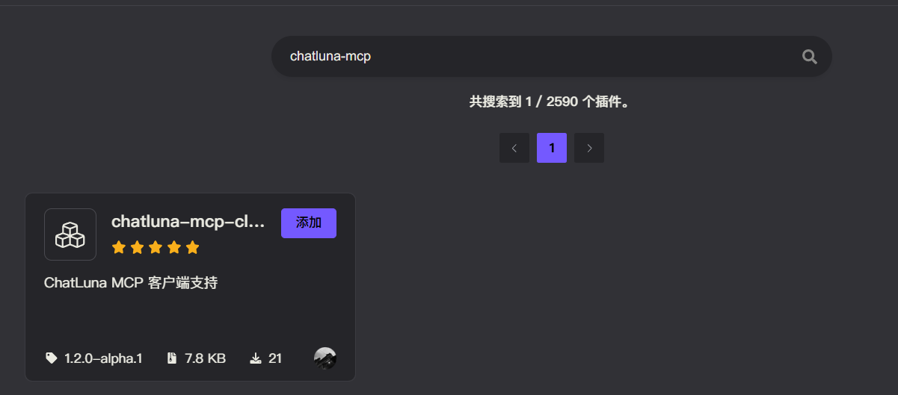

# MCP 协议客户端 （MCP Client）

MCP 协议是 Model Context Protocol 的缩写，用于在不同的模型之间传递上下文。

此插件为 ChatLuna 的 Agent 模式提供了 MCP 协议支持。

## 配置

* 前往插件市场搜索 `chatluna-mcp-client` 并安装。



::: tip 提示
如果无法正常搜索到 `chatluna-mcp-client`，则说明官方插件源没有正常更新。
前往 market 插件设置为其他源即可：


以下是推荐的一些插件源：

* [https://koishi-registry.yumetsuki.moe/index.json](https://koishi-registry.yumetsuki.moe/index.json)
* [https://kp.itzdrli.cc](https://kp.itzdrli.cc)

:::

安装后启用插件即可。

## 使用

> [!TIP]
> 启用此插件时，请确保你当前聊天房间的聊天模式为 `plugin` Agent 模式。
> 可以查看 [聊天模式](../../guide/chat-chain/chat-mode.md) 了解如何切换聊天模式。

启用插件后，调用 `chatluna.mcp.add` 指令即可。

指令添加的参数基本和 `Claude Desktop` 和 `Cursor` 的 `mcpServers` 参数一致。

如 `Claude Desktop` 的一个 MCP 配置如下：

```json
{
  "mcpServers": {
    "exa": {
      "command": "npx",
      "args": ["/path/to/exa-mcp-server/build/index.js"],
      "env": {
        "EXA_API_KEY": "your-api-key-here"
      }
    }
  }
}
```

直接调用指令即可：

<chat-panel>
  <chat-message nickname="User">chatluna.mcp.add {<br/>
  "mcpServers": {<br/>
    "exa": {<br/>
      "command": "npx",<br/>
      "args": ["/path/to/exa-mcp-server/build/index.js"],<br/>
      "env": {<br/>
        "EXA_API_KEY": "your-api-key-here"<br/>
      }<br/>
    }<br/>
  }<br/>
}</chat-message>
  <chat-message nickname="Bot">
   成功添加了 1 个 MCP 服务器。
  </chat-message>
</chat-panel>

完成后，则会在日志中看到类似的信息（会列出可用的工具数目）：


> [!TIP]
>
> 1. 本地 MCP 需要调用某些包管理器的执行命令（npx/uv 等）。请确保你的 Koishi 支持这些命令。如果不存在，请安装对应的依赖。
>
> 2. 上面的 Exa MCP 服务器，还需要额外配置 API Key。请在调用添加指令时，修改为需要的参数。

## 指令

ChatLuna MCP Client 提供了一些实用的 MCP 工具管理指令，用于管理 MCP 服务器和工具。

### 列出 MCP 工具

列出当前可用的 MCP 工具或服务器配置。

以下为命令格式:

```powershell
chatluna.mcp.list -r
```

以下为可选参数:

* `-r,--raw`: 列出原始的 MCP 服务器配置，而不是工具列表。

以下为例子:

<chat-panel>
  <chat-message nickname="User">chatluna.mcp.list</chat-message>
  <chat-message nickname="Bot">以下是当前可用的 MCP 工具列表：<br/>
工具名称：exa_search<br/>
工具状态：✓<br/>
选择器：无<br/>
---<br/>
工具名称：read_file<br/>
工具状态：✓<br/>
选择器：无<br/>
---
  </chat-message>
</chat-panel>

### 添加 MCP 服务器

添加新的 MCP 服务器配置。

:::warning 警告
此命令需要被执行者最低 3 级权限。
:::

以下为命令格式:

```powershell
chatluna.mcp.add <mcpConfig:text>
```

以下为必须参数：

* `mcpConfig:text`: MCP 服务器配置（JSON 格式），格式与 Claude Desktop 和 Cursor 的 `mcpServers` 参数一致。

以下为例子:

<chat-panel>
  <chat-message nickname="User">chatluna.mcp.add {<br/>
  "mcpServers": {<br/>
    "filesystem": {<br/>
      "command": "npx",<br/>
      "args": ["-y", "@modelcontextprotocol/server-filesystem", "/path/to/allowed/files"]<br/>
    }<br/>
  }<br/>
}</chat-message>
  <chat-message nickname="Bot">成功添加了 1 个 MCP 服务器。
  </chat-message>
</chat-panel>

如果添加的服务器名称已存在，系统会提示是否覆盖：

<chat-panel>
  <chat-message nickname="User">chatluna.mcp.add {<br/>
  "mcpServers": {<br/>
    "exa": {<br/>
      "command": "npx",<br/>
      "args": ["new-server.js"]<br/>
    }<br/>
  }<br/>
}</chat-message>
  <chat-message nickname="Bot">检测到以下服务器名称已存在：exa<br/>
是否覆盖现有服务器配置？输入 Y 确认，其他任何输入取消。
  </chat-message>
  <chat-message nickname="User">Y</chat-message>
  <chat-message nickname="Bot">成功添加了 1 个 MCP 服务器。
  </chat-message>
</chat-panel>

### 移除 MCP 服务器

移除已配置的 MCP 服务器。

:::warning 警告
此命令需要被执行者最低 3 级权限。
:::

以下为命令格式:

```powershell
chatluna.mcp.remove <serverName:string>
```

以下为必须参数：

* `serverName:string`: 要移除的服务器名称。

以下为例子:

<chat-panel>
  <chat-message nickname="User">chatluna.mcp.remove exa</chat-message>
  <chat-message nickname="Bot">成功移除服务器 exa。
  </chat-message>
</chat-panel>

### 启用或禁用 MCP 工具

切换 MCP 工具的启用状态。

:::warning 警告
此命令需要被执行者最低 3 级权限。
:::

以下为命令格式:

```powershell
chatluna.mcp.enable <toolName:string>
```

以下为必须参数：

* `toolName:string`: 要启用或禁用的工具名称。

以下为例子:

<chat-panel>
  <chat-message nickname="User">chatluna.mcp.enable exa_search</chat-message>
  <chat-message nickname="Bot">已将工具 exa_search 禁用。
  </chat-message>
</chat-panel>

再次执行相同命令可以重新启用工具：

<chat-panel>
  <chat-message nickname="User">chatluna.mcp.enable exa_search</chat-message>
  <chat-message nickname="Bot">已将工具 exa_search 启用。
  </chat-message>
</chat-panel>

## 配置项

此处列举了 `chatluna-mcp-client` 插件的配置项。

### servers

* 类型: `string`
* 默认值: `{"mcpServers": {}}`

MCP 服务器的 JSON 配置。支持与 Claude Desktop 和 Cursor 相同的配置格式。

配置格式示例：

```json
{
  "mcpServers": {
    "server-name": {
      "command": "npx",
      "args": ["-y", "@modelcontextprotocol/server-example"],
      "env": {
        "API_KEY": "your-api-key"
      },
      "cwd": "/path/to/working/directory"
    },
    "server-name2": {
      "url": "https://mcp.jina.ai/sse",
      "headers": {
        "Authorization": "Bearer KEY"
      },
      "timeout": 120,
    }
  }
}
```

每个服务器配置支持以下字段：

* `command`: 执行的命令（如 `npx`、`node`、`python` 等）
* `args`: 命令参数数组
* `env`: 环境变量对象（可选）
* `cwd`: 当前工作目录（可选）
* `url`: MCP 服务器的 URL（用于 HTTP 或者 SSE 类型的服务器，可选）
* `timeout`: 调用此服务器下所有工具的超时时间，按秒计算，默认 60。

### tools

* 类型: `Record<string, ToolConfig>`
* 默认值: `{}`

启用工具的配置。可以为每个工具单独配置启用状态和选择器。

每个工具配置包含以下字段：

* `name`: 注册到 ChatLuna 的工具名称
* `enabled`: 是否启用此工具（默认为 `true`）
* `selector`: 消息内容选择器数组，用于限制工具在特定场景下的使用（默认为空数组）
* `timeout`: 调用此工具的超时时间，按秒计算，默认 60。可以覆盖上面的服务器级别的超时时间。
