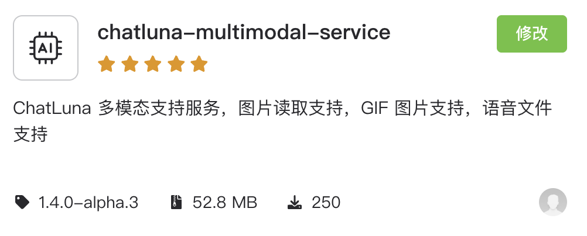

# 多模态服务 (Multimodal Service)

此插件为 ChatLuna 提供多模态支持，包括上下文图像/语音描述、GIF 处理与 `read_files` 文件读取工具。为不支持图像/音频多模态的模型提供多模态识别能力，并支持将不支持的音频格式转码后注入上下文。

## 配置

* 前往插件市场搜索 `chatluna-multimodal-service` 并安装。

* 安装完成后，参考下面的插件配置，配置插件。

* 启用插件。

## 使用

确保配置插件后，启用插件即可。

插件主要提供以下能力：

### 上下文图像描述服务

为上下文中的图像提前生成文本描述，使不支持图像输入的模型可以直接在对话历史记录中看到图像对应的文本描述。

若当前模型本身支持图像输入，则会直接将图像（GIF 会被拆分为帧）注入上下文，不经过描述模型。

### 音频转码注入

当模型支持音频输入但接收到的音频格式不被原生支持时（如 Silk、AMR 等），会通过 ffmpeg 转码为 MP3 后再注入上下文。主要针对语音消息。

### 文件读取/描述工具 (`read_files`)

允许模型调用 `read_files` 工具读取 URL 中的图像（如工具返回的图像 URL）、文件内容，并根据读取的内容回答用户的问题。

支持读取的文件类型包括：图像（BMP、JPEG、PNG、WebP、GIF）、纯文本、Markdown、HTML、JSON、PDF、音频、视频等（具体取决于模型能力）。

> [!TIP] 提示
> 建议搭配 `chatluna-storage-service` 使用。请求中的图像、文件大小限制遵循模型平台配置（如 Gemini：PDF 单文件 50MB、其他单文件 100MB、单轮总计 100MB，以文件被编码为 Base64 后的大小为准）。

## 配置项

此处列举了 `chatluna-multimodal-service` 插件的配置项。

### 上下文图像描述服务设置

#### enableContextImageDescription

* 类型：`boolean`
* 默认值：`false`

是否为上下文中的图像使用图像描述服务生成并注入文本描述。仅当前模型不支持图像输入时生效。

#### enableContextGifHandling

* 类型：`boolean`
* 默认值：`false`

是否为上下文中的 GIF 使用图像描述服务生成并注入文本描述。关闭后 GIF 将被从上下文中移除。

### 文件读取/描述工具设置

#### enableImageReadTool

* 类型：`boolean`
* 默认值：`false`

启用 `read_files` 工具的图像读取/描述功能（非 GIF）。若当前模型不支持图像输入，则会使用图像描述模型生成描述。若当前模型支持图像输入，建议只保留这一个图像读取工具开启，因为它能使模型自己看见图像内容，比图像描述更加精确。

#### enableGifReadTool

* 类型：`boolean`
* 默认值：`false`

启用 `read_files` 工具的 GIF 描述功能。

#### enableFileReadTool

* 类型：`boolean`
* 默认值：`false`

启用 `read_files` 工具的通用文件读取功能（支持纯文本、PDF、JSON、音频、视频等，具体取决于模型能力）。若模型不支持该文件类型输入，则会返回报错。

### 音频转换设置

#### enableAudioFfmpegConversion

* 类型：`boolean`
* 默认值：`false`

启用不支持音频格式的 ffmpeg 转换。仅当当前模型不原生支持该音频格式时，才会先转码为 MP3 再注入，主要针对语音消息。需要安装并启用 `koishi-plugin-ffmpeg-path`；其中官方 Bot 的 silk 语音依赖 `koishi-plugin-ffmpeg-path` 2.0.0 及以上版本提供的 silk 服务。

### 文件读取设置

#### fileInsertPrompt

* 类型：`string`
* 默认值：`以下是通过工具读取的文件内容，请结合这些内容回答用户的问题。`

文件内容注入到上下文时的提示词。在注入的文件内容前面追加此提示词，用于引导模型结合文件内容回答问题。

### 图像描述服务设置

#### imageModel

* 类型：`string`
* 默认值：`无`

选择支持图像输入的模型以生成图像描述（如 `gemini-3-flash-preview`、`qwen3.5-flash`、`doubao-seed-2.0-lite`）。

#### imagePrompt

* 类型：`string`
* 默认值：`你现在是一个图片描述大师。你需要根据下面提供的图片，对该图片或者图片列表生成 150-400 字的中文描述。包括图片的主要内容和场景，里面可能包含的梗，人物等。`

传递给图像描述模型的系统提示词。

#### imageInsertPrompt

* 类型：`string`
* 默认值：`这是一张图片的描述: {img}。如果用户需要询问一些关于图片的问题，请根据上面的描述回答。如果用户没有提供图片，请忽略上面的描述。</img>`

图像描述插入到具体消息里的提示词。

#### gifStrategy

* 类型：`'first' | 'head' | 'average'`
* 默认值：`first`

GIF 图像帧提取策略：

* `first`：只获取第一帧
* `head`：获取前 N 帧
* `average`：平均获取 N 帧

#### gifFrameCount

* 类型：`number`
* 默认值：`3`
* 范围：`1-5`

提取的帧数（仅在选择 `head` 或 `average` 策略时有效）。
