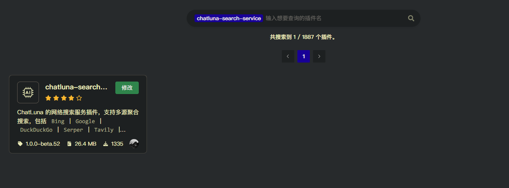
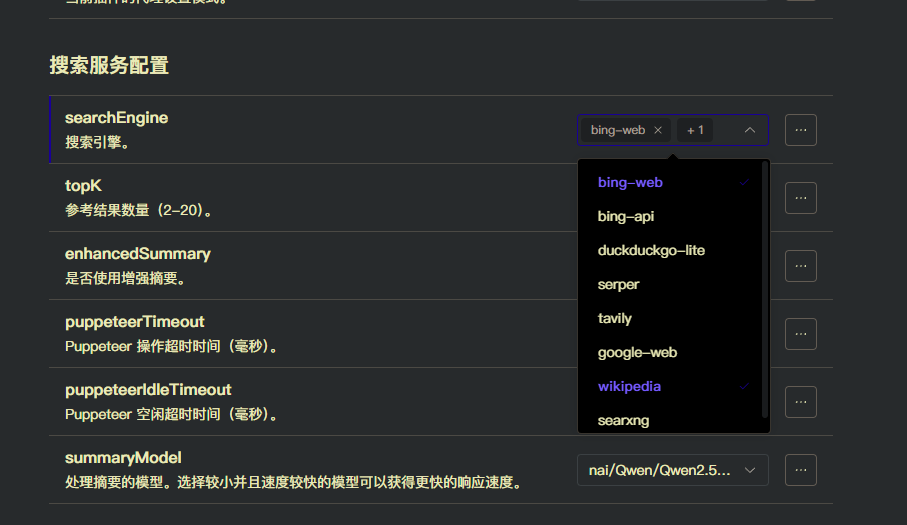

# 搜索服务 (Search Service)

此插件为 ChatLuna 提供多源的聚合搜索工具，并且基于 `Puppeteer` 提供网页浏览能力工具。

## 配置

- 前往插件市场，安装 `puppeteer` 插件。（大部分情况下 Koishi 已经安装了此插件，直接启用就好）
- 前往插件市场搜索 `chatluna-search-service` 并安装。

完成后则可以进行搜索引擎配置。

### 搜索引擎配置

打开 `chatluna-search-service` 插件的配置页面。可以看到我们能选择多种搜索引擎进行多源聚合搜索。

但大部分搜索引擎都需要额外的配置相关参数，才能正常使用。

#### bing-web、google-web、duckduckgo-lite

只需确认 `puppeteer` 插件启用，并且你的网络环境可以正常访问 Bing、Google 和 DuckDuckGo 即可。

#### serper

前往 [Serper](https://serper.dev/) 注册账号并获取 API Key。
填写相关参数到 [Serper 设置](#searxng-设置) 配置项中即可。

#### tavily

前往 [Tavily](https://app.tavily.com/home) 注册账号并获取 API Key。
填写相关参数到 [Tavily 设置](#tavily-设置) 配置项中即可。

#### bing-api

前往 [Bing](https://learn.microsoft.com/en-us/bing/search-apis/bing-web-search/overview) 获取 API Key。
填写相关参数到 [Bing API 设置](#bing-api-设置) 配置项中即可。

#### searxng

前往 [searxng](https://searx.space/) 获取可用的公共实例。
填写相关地址到 [searxng 设置](#searxng-设置) 配置项中即可。

#### wikipedia

你可以寻找支持 `mediawiki` 的维基网站，填入 API 地址到 [Wikipedia 设置](#wikipedia) 配置项中即可。

我们默认提供了 `https://en.wikipedia.org/w/api.php` 和 `https://mzh.moegirl.org.cn/api.php` 两个维基网站。

## 使用

配置完成后直接启用插件即可。此时已经可以正常使用 `browsing` 聊天模式和相关工具了。

## 配置项

此处列举了 `chatluna-search-service` 插件的配置项。

### 搜索服务配置

#### searchEngine

- 类型: `string[]`
- 默认值: `[]`

启用的搜索引擎列表。可选值包括：`bing-web`、`google-web`、`duckduckgo-lite`、`serper`、`tavily`、`bing-api`、`searxng`、`wikipedia`。

此配置项支持多选，意味着你可以同时启用多个搜索引擎进行聚合搜索。

#### topK

- 类型: `number`
- 默认值: `5`
- 范围: `2-20`

参考结果数量。此值决定每次搜索返回的结果数量。
此值不要设置过大或者过小，都会影响到模型输出的质量。
我们推荐配置在 `3-6` 之间。

#### enhancedSummary

- 类型: `boolean`
- 默认值: `false`

是否启用增强摘要功能。启用后会对搜索结果的网页进行访问，以求获取更详细的内容。

#### puppeteerTimeout

- 类型: `number`
- 默认值: `60000`

Puppeteer 操作超时时间（毫秒）。

#### puppeteerIdleTimeout

- 类型: `number`
- 默认值: `300000`

Puppeteer 空闲超时时间（毫秒）。

#### summaryModel

- 类型: `string`
- 默认值: `gpt-3.5-turbo`

处理搜索结果的模型。在启用了增强摘要功能后，会使用此模型总结和分析搜索获取的内容。

### Serper 设置

#### serperApiKey

- 类型: `string`
- 默认值: ``

Serper API 密钥。

#### serperCountry

- 类型: `string`
- 默认值: `cn`

Serper 搜索地区。

#### serperLocation

- 类型: `string`
- 默认值: `zh-cn`

Serper 搜索语言。

#### serperSearchResults

- 类型: `number`
- 默认值: `10`

Serper 搜索结果数量。

### Bing API 设置

#### bingSearchApiKey

- 类型: `string`
- 默认值: ``

Bing API 密钥。

#### bingSearchLocation

- 类型: `string`
- 默认值: `zh-CN`

Bing API 搜索地区。

#### azureLocation

- 类型: `string`
- 默认值: `global`

Azure API 服务地区。

### Tavily 设置

#### tavilyApiKey

- 类型: `string`
- 默认值: ``

Tavily API 密钥。

### Wikipedia 设置

#### wikipediaBaseURL

- 类型: `string[]`
- 默认值: `["https://en.wikipedia.org/w/api.php", "https://mzh.moegirl.org.cn/api.php"]`

Wikipedia API 基础 URL。可以添加多个维基网站的 API 地址。

#### maxWikipediaDocContentLength

- 类型: `number`
- 默认值: `5000`

Wikipedia 文档内容的最大长度。超出此长度的内容会被截断。

### SearxNG 设置

#### searxngBaseURL

- 类型: `string`
- 默认值: `https://paulgo.io`

SearxNG API 基础 URL。可以填写任意可用的 SearxNG 实例地址。

### 进阶设置

> [!WARNING] 提示
> 如果你对 Prompt 工程不够熟悉，不要随意修改以下配置。否则会直接影响模型生成的质量。

#### searchPrompt

- 类型: `string`
- 默认值: `....`

搜索任务的 Prompt。用于模型理解搜索任务，并基于搜索结果生成符合人类偏好的回答。

#### newQuestionPrompt

- 类型: `string`
- 默认值: `....`

新问题 Prompt。用于模型理解用户的输入，并基于当前上下文生成新的回答。
