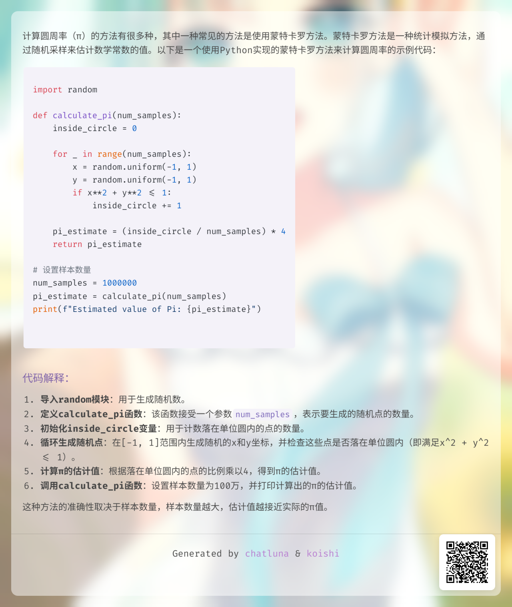

# 图片渲染器

图片渲染器是 ChatLuna 官方的回复渲染器之一。

用于将模型的回复渲染为图片，默认支持 Markdown 渲染。

## 配置

- 前往插件市场，安装 `puppeteer` 和 `chatluna-image-renderer` 插件。
- 启用 `chatluna-image-renderer` 插件即可。

## 使用

在使用之前，参考 [渲染输出](../../guide/chat-chain/output-mode.md#配置) 配置好输出格式为 `image` 或 `mixed-image`。

此时再和模型对话，输出为图片则表示渲染成功。

<chat-panel>
  <chat-message nickname="User">chatluna.chat.text 写一段代码实现计算圆周率
17:17</chat-message>
  <chat-message nickname="Bot">
   
  </chat-message>

</chat-panel>

## 配置项

此处列举了 `chatluna-image-renderer` 插件的配置项。

### qrCode

- 类型：`boolean`
- 默认值：`true`

是否在图片中显示二维码。扫描二维码后可以获取渲染图片内的详细内容。二维码默认一天后过期。

### background

- 类型：`string[]`
- 默认值：`[${imageDir}/background/default.webp]`

背景图片列表，用于渲染时的背景显示。具体效果可以查看上面的示例。

### blurAmount

- 类型：`number` (px)
- 默认值：`10`

背景图片的模糊程度(像素)，取值范围为 0 到 100。

### backgroundMaskOpacity

- 类型：`number`
- 默认值：`0.5`
- 最小值：`0`
- 最大值：`1`

背景图片的白色透明度，取值范围为 0 到 100。
