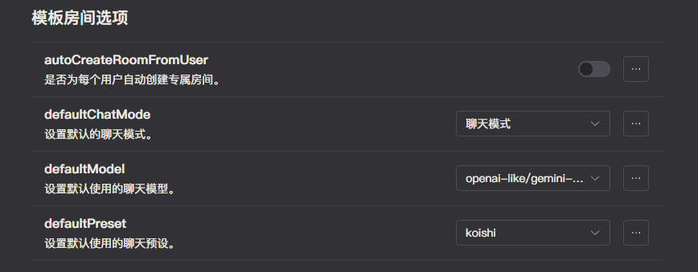

# 知识库客服 Bot

在本节中，我们将以 Koishi 客服 bot 为例，介绍使用 ChatLuna 搭建一个知识库客服 Bot。

## 前置步骤

由于 ChatLuna 基于 Koishi 相关 API 进行了扩展操作，你需要进行多步配置以完成相关环境的搭建。

1. 安装 ChatLuna 插件及其模型适配器，确保能够正常的使用 ChatLuna 进行对话。
2. 配置长期记忆，包括嵌入模型和向量数据库。如果你还没有配置，请参考 [向量数据库](../configure-vector-database/introduction.md) 和 [嵌入模型](../configure-embedding-model/introduction.md) 进行配置。完成后记得在主插件中选择 [默认的嵌入模型](../useful-configurations.md#defaultembeddings) 和 [默认的向量数据库](../useful-configurations.md#defaultvectorstore)。
3. 安装知识库插件，并且选择 [模型](../../ecosystem/extension/knowledge.md#model)。

> [!WARNING] 警告
> 下面的操作需要确保你的 ChatLuna 关闭了 [自动创建房间](../useful-configurations.md#autocreateroomfromuser)。

## 添加预设

在完成前置步骤后，我们推荐编写一个预设，用于知识库的回复。

::: details preset.yml
<<< ../../public/resources/knowledge_preset.yml
:::

在 ChatLuna 中，应用我们的预设。

> [!TIP] 提示
> 知识库插件不一定要编写专用预设，你可以在知识库插件中配置 [默认知识库](../../ecosystem/extension/knowledge.md#defaultknowledge)。
> 配置完成后也可以正常使用。

## 上传文档

在确认前置步骤完成了之后，我们就可以把文档上传到知识库了。

可以从 [此处](https://github.com/koishijs/docs/archive/refs/heads/main.zip) 下载 Koishi 的官方文档。

> [!TIP] 提示
>
> 1. 下载来的文档包含了多语言，请自行挑选出你需要的语言。
> 2. 下载完成后的文档不可以进行商业用途，请在学习完成后自行删除。

完成后直接调用相关命令，输入的路径为文档文件夹。

<chat-panel>
  <chat-message nickname="User">chatluna knowledge upload C:\Users\dingyi\Downloads\koishi</chat-message>
  <chat-message nickname="Bot">
   已对 C:\Users\dingyi\Downloads\koishi 解析成 1325 个文档块。正在保存至数据库
  </chat-message>
  
——— 2 分钟后 ———

  <chat-message nickname="Bot">
   已成功上传到 faiss 向量数据库
  </chat-message>
</chat-panel>

## 使用

确保已经使用了上面的预设，并且上传了文档，就可以开始使用了。

<chat-panel>
  <chat-message nickname="User">chatluna chat text koishi 主要维护者是谁</chat-message>
  <chat-message nickname="Bot">
   Koishi 的主要维护者是 Shigma，他是该项目的创始人，并由其核心团队一同维护。
  </chat-message>
  <chat-message nickname="User">koishi支持哪些部署方式</chat-message>
  <chat-message nickname="Bot">

根据提供的文档，Koishi 支持以下几种部署方式：

1. <strong>安装包安装</strong>：这是最推荐的安装方式，Koishi 提供了 Windows 的 .msi 安装包 和 macOS 的 .pkg 安装包。安装程序会自动处理大部分问题，适合大多数用户。

2. <strong>容器中使用 (Docker)</strong>：用户可以选择使用 Docker 容器来部署 Koishi，这种方式更灵活，也方便在不同环境中使用。

3. <strong>创建模板项目</strong>：用户可以通过创建模板项目来部署 Koishi，这种方式适合开发者，可以更方便地进行二次开发和调试。

此外，文档中也提到，如果选择 http 作为通信方式，那么需要准备带有 SSL 证书的公网域名，并将 Koishi 部署到公网。这暗示了 Koishi 也可以部署在公网服务器上。

总结来说，Koishi 的部署方式包括：

• <strong>桌面安装包</strong> (Windows/macOS) 
• <strong>Docker 容器</strong> 
• <strong>模板项目</strong> 
• <strong>公网服务器</strong> (使用 http 通信时)

  </chat-message>
</chat-panel>
