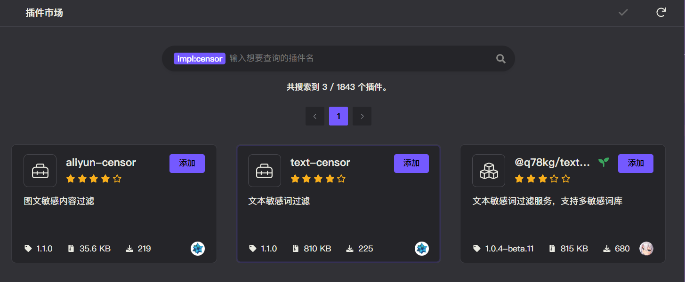
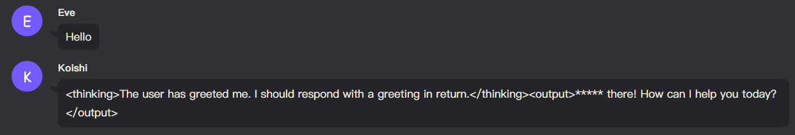

# 文本审核

ChatLuna 基于 Koishi 的 [Censor 服务](https://censor.koishi.chat/plugins/text.html) 实现了文本审核功能。

## 配置

前往 Koishi 插件市场，搜索实现了 `censor` 服务的插件，安装并配置。

::: tip 提示
可以使用 `impl:censor` 来搜寻实现了 `censor` 服务的插件。
:::

配置相关插件完成后，前往 ChatLuna 主插件的设置界面，开启 [censor](../useful-configurations.md#censor) 选项即可。

## 使用

配置完成后正常使用即可。ChatLuna 会自动调用 `censor` 服务进行文本审核。

::: warning 注意
大部分 `censor` 服务只对文字内容进行审核过滤，对于音频或图片内容，可能无法审核。
:::
