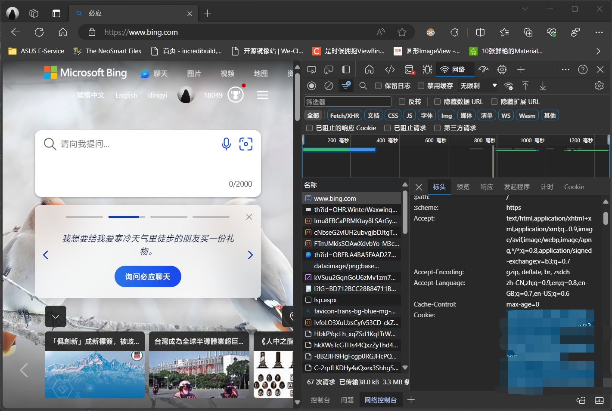

# New Bing

New Bing 是基于 GPT 4 的聊天机器人，可以实现对话式问答。并结合 Bing 的搜索能力与网页阅读能力实现实时联网获取信息。

我们支持对接 New Bing 中的三种聊天模式（创造，平衡，精确），并且额外适配了 New Bing 的识图功能。

::: tip 提示
我们不会适配 New Bing 的画图功能。
:::

## 安装

前往插件市场，搜索 `chatluna-newbing-adapter`，安装即可。

## 配置

在配置之前，请先确认你的 Bing 账号具有 New Bing 的访问权限，并且目前可以使用当前的浏览器正常访问 New Bing。

如果你的 Koishi 部署在国内环境，请你为 ChatLuna 设置插件代理。

::: tip 提示
未来我们可能会录制官方教程，敬请期待。
:::

打开 `Microsoft Edge` 浏览器（其他基于 Chromium 内核的浏览器也类似），然后键入 `https://www.bing.com` 打开 bing 官网。

按 `f12`，打开开发者工具，并转到网络选项卡。

点击上方的红色监听按钮取消监听，在点击一次监听按钮然后立即按 `f5` 刷新网页。等待几秒后点击监听按钮取消监听。

此时滚动鼠标，将监听列表拉至最上，可以看到 `bing.com` 的请求，点开它。

打开后会自动为我们进入标头选项卡。里面含有 `常规`，`响应标头`，`请求标头` 三大项，我们将前两项折叠，从 `请求标头` 内寻找 `cookie`。

在 `请求标头` 内找到 `cookie` 项，滚动鼠标以全选 cookie，将其复制。此时你已经复制了使用 New Bing 适配器所需 cookie。

让我们回到插件的配置页。当你新建插件后，插件默认会提供一个 cookie 配置项（即 cookies[0]），将我们刚才复制的 cookie 粘贴进去。

记得点击右上角的保存按钮。

## 使用

在 New Bing 适配器的配置页面，点击运行按钮，如无误，你应该看不到任何错误 log，随后可转到 ChatLuna 的主插件页面。

在主插件页面，下划到 [模版房间选项](../useful-configurations.md#模版房间选项)，查看 [defaultModel](../useful-configurations.md#defaultmodel) 的选项里是否含有符合 `bing/xxx` 格式的模型，如果有，则说明 New Bing 适配器已经成功的运行。

但我们仍未确认 New Bing 适配器是否连接到 New Bing。

因此我们需要新建一个房间，使用 `chatluna.room.create -m bing/creative -p chatgpt -n test-bing-adapter -c chat -v private` 指令来创建一个使用了 New Bing 适配器的房间。

让我们尝试和模型对话。

只要能正常对话，就说明你成功的连接到了 New Bing，接入了 New Bing 适配器。

别忘了在测试完成后调用 `chatluna.room.delete test-bing-adapter` 指令删除测试房间。

## 常见问题

### 什么是 Sydney 模式？

开启 Sydney 模式后，会通过某些方式突破 New Bing 的限制，可以做到：

1. 支持上下文对话，不再局限于 30 次限制（但是仍然是有限的，历史聊天记录容量太大就可能会裁剪或清空对话）
2. 人格设定，设置系统 Prompt，默认设置为 Sydney

而且打开此功能突破了限制后账号可能会有被封风险，谨慎使用。
