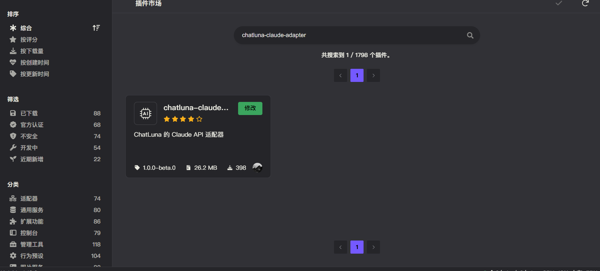
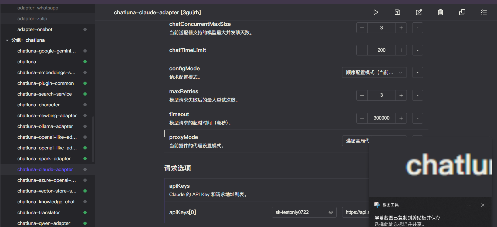

# Claude

Claude 是 Anthropic 公司推出的大语言模型，旗下同时开放 `claude-4.5-Sonnet`,`claude-3.5-haiku` 等模型。

我们支持对接 Claude 里大部分可用的聊天大语言模型或嵌入模型。

由于 API 限制，我们无法获取到 Claude 的最新模型列表。模型列表会滞后一段时间更新。

## 安装

前往插件市场，搜索 `chatluna-claude-adapter`，安装即可。

## 配置

在配置之前，请先前往 [Claude](https://console.anthropic.com/settings/keys) 获取 API key。

如使用的是其他代理平台（转发接口，API-Adapter），还需额外获取 API host 地址。

::: tip 提示
未来我们可能会录制官方教程，敬请期待。
:::

获取到 API key 后，转到 `claude-adapter` 的配置页面。

默认插件有一个空的适配项，填入你的 API key 即可。

记得点击右上角的保存按钮。

## 使用

在 Claude 适配器的配置页面，点击运行按钮，检查你的日志界面，是否看到错误日志。

如无误，则可以转到沙盒或者其他聊天平台，使用 `chatluna.model.test` 命令查看是否接入成功：

<chat-panel>
  <chat-message nickname="User">chatluna.model.test claude-3-5-haiku-20241022</chat-message>
  <chat-message nickname="Bot">模型 claude/claude-3-5-haiku-20241022 测试成功！ 
响应时间：2255ms 
示例回复：Hello! How can I assist you today? 
  </chat-message>
</chat-panel>  

测试成功后，则代表你已成功接入 Claude 平台，可以正常使用了。

## 常见问题

### 1. 国内平台如何接入？

国内平台接入 Claude 官方的接口，需要代理设置，前往主插件的配置页面，开启 [代理模式](../useful-configurations.md/#isproxy)，并且配置 [代理地址](../useful-configurations.md#proxyaddress)。

> [!TIP] 提示
> 社区成员提供了免费的反向代理地址，使用反向代理地址无需开启代理模式，请在确认风险后使用。
>
> 使用方式：使用方式：将默认的 <https://api.anthropic.com/v1> 替换为以下地址。
>
> 地址: [https://claude.api.2s.lol/v1](https://claude.api.2s.lol/v1)
>
> 此地址并非 ChatLuna 官方认证的地址，请自行判断是否安全。
