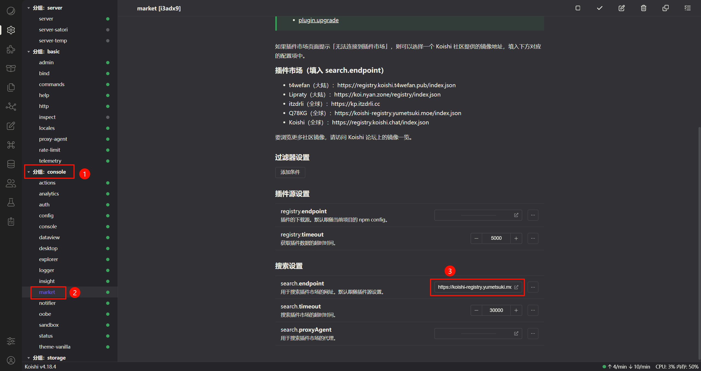
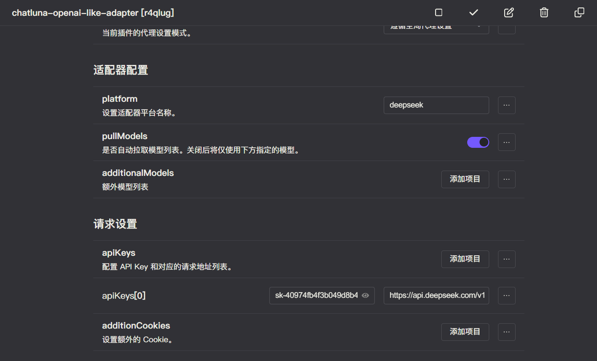
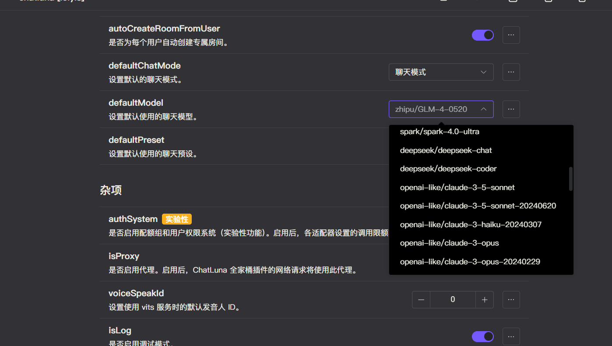

# DeepSeek

DeepSeek 是一家专注于通用人工智能底层模型与技术研究的公司，成立于2023年，由知名私募巨头幻方量化创立。公司致力于探索人工智能的本质，发布了多个开源大模型，包括 DeepSeek-LLM 通用大语言模型和 DeepSeek-Coder 代码大模型等。

我们可以安装 `openai-deepseek-adapter` 适配器来使用该公司提供的模型。

## 安装

前往插件市场，搜索 `chatluna-deepseek-adapter`，安装即可。

::: tip 提示
如果无法正常搜索到 `chatluna-deepseek-adapter`，则说明官方插件源没有正常更新。
前往 market 插件设置为其他源即可：

以下是推荐的一些插件源：

- [https://koishi-registry.yumetsuki.moe/index.json](https://koishi-registry.yumetsuki.moe/index.json)
- [https://kp.itzdrli.cc]([https://kp.itzdrli.cc)

:::

## 配置

在配置之前，请先前往 [DeepSeek](https://platform.deepseek.com/api_keys) 获取 API key。

::: tip 提示
未来我们可能会录制官方教程，敬请期待。
:::

获取到 API key 后，转到 `deepseek-adapter` 的配置页面。
。
当然，你也可以更改你喜欢的其他平台名。

完成后在请求设置里填入你的 API key 和 请求地址。请求地址应为 `https://api.deepseek.com/v1`。

记得点击右上角的保存按钮。

## 使用

在适配器的配置页面，点击运行按钮，如无误，你应该看不到任何错误 log，那即可转到 ChatLuna 的主插件页面。

在主插件页面，下划到 [模版房间选项](../useful-configurations.md#模版房间选项)，查看 [defaultModel](../useful-configurations.md#defaultmodel) 的选项里是否含有 DeepSeek 模型，如果有，则说明你已经成功地接入了 DeepSeek 平台。

