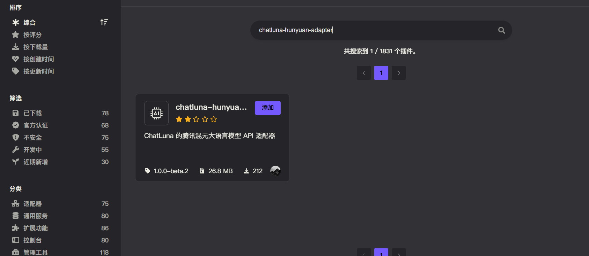
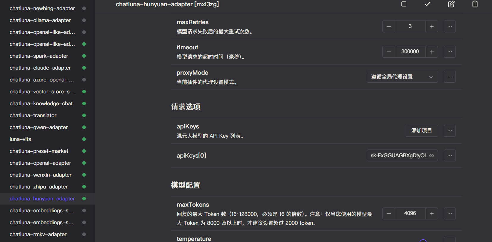
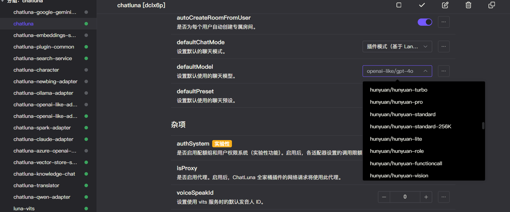

# 混元大模型

混元大模型 API 是腾讯全链路自研的通用大语言模型，拥有超千亿参数规模，预训练语料超 2 万亿 tokens，具备强大的中文创作能力、复杂语境下的逻辑推理能力以及多语言支持能力。该模型通过腾讯云对外开放，客户可以直接通过 API 调用混元，也可以将混元作为基底模型，为不同产业场景提供定制化服务。

我们支持对接腾讯公司提供的大部分可用的混元聊天大语言模型或嵌入模型。

由于 API 限制，我们无法获取到混元最新可用模型列表，所以当百度公司发布新模型时，我们滞后一段时间才会更新模型列表。

## 安装

前往插件市场，搜索 `chatluna-hunyuan-adapter`，安装即可。

## 配置

在配置之前，请先参考 [混元API接入指南](https://cloud.tencent.com/document/product/1729/97730) 开通服务，然后前往 [控制台](https://console.cloud.tencent.com/hunyuan/api-key) 获取 API Key。

::: tip 提示
未来我们可能会录制官方教程，敬请期待。
:::

获取到相关配置后，转到 `hunyuan-adapter` 的配置页面。

默认插件有一个空的适配项，填入你的 API key 即可。

记得点击右上角的保存按钮。

## 使用

在混元适配器的配置页面，点击运行按钮，如无误，你应该看不到任何错误 log，那即可转到 ChatLuna 的主插件页面。

在主插件页面，下划到 [模版房间选项](../useful-configurations.md#模版房间选项)，查看 [defaultModel](../useful-configurations.md#defaultmodel) 的选项里是否含有混元模型，如果有，则说明混元适配器已经成功的运行。

但我们仍未完全确认混元适配器是否可用。

因此我们需要新建一个房间，使用 `chatluna.room.create -m hunyuan/hunyuan-turbo -p chatgpt -n test-hunyuan-adapter` 指令来创建一个使用了混元适配器的房间。

然后尝试和模型对话。

只要能正常对话，就说明你成功的连接到了混元 API。

别忘了在测试完成后调用 `chatluna.room.delete test-hunyuan-adapter` 指令删除测试房间。
