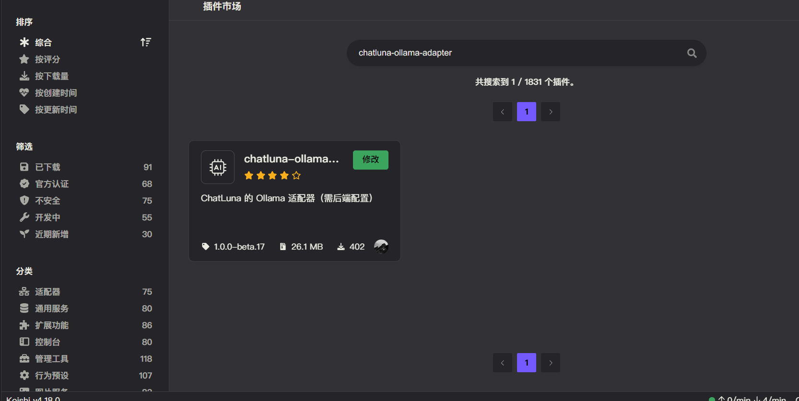
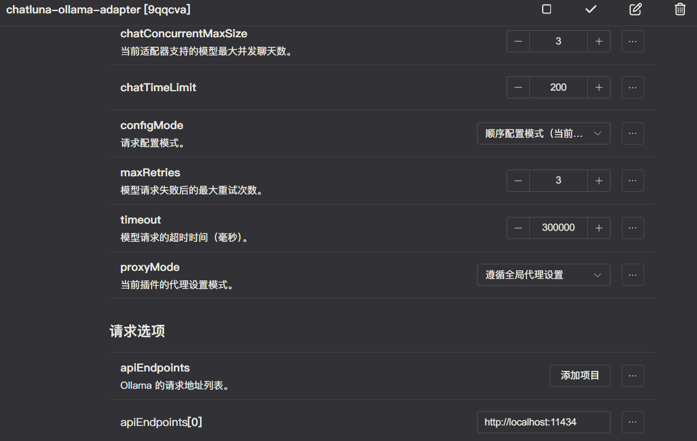
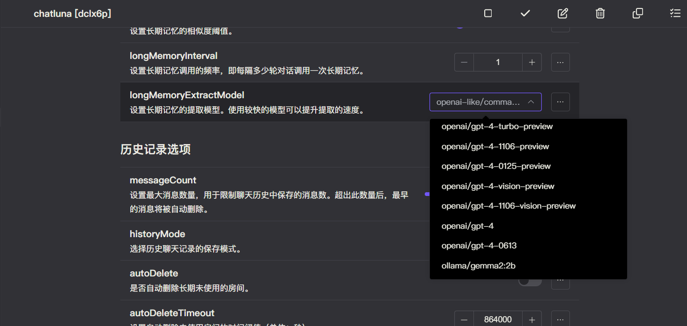

# Ollama

Ollama 是一个开源的大型语言模型（LLM）服务工具，旨在简化在本地环境中运行和管理这些模型的过程。它为开发者、研究人员和爱好者提供了一个轻量级、可扩展的框架，使得他们能够在本地快速实验、管理和部署各种开源的大型语言模型。

我们支持对接 Ollama 提供的语言模型。

## 安装

前往插件市场，搜索 `chatluna-ollama-adapter`，安装即可。

## 配置

在配置之前，请先参考 [Github](https://github.com/ollama/ollama/tree/main?tab=readme-ov-file) 来搭建和运行 Ollama 后端。

::: tip 提示
未来我们可能会录制官方教程，敬请期待。
:::

确保 Ollama 服务成功运行后，即可转到 Ollama 适配器。

默认插件已经设置了在本地运行的 Ollama 服务地址，当然你也可以设置为其他地址。

设置好后，记得点击右上角的保存按钮。

## 使用

在 Ollama 适配器的配置页面，点击运行按钮，如无误，你应该看不到任何错误 log，那即可转到 ChatLuna 的主插件页面。

在主插件页面，下划到 [模版房间选项](../useful-configurations.md#模版房间选项)，查看 [defaultModel](../useful-configurations.md#defaultmodel) 的选项里是否含有 Ollama 提供的模型，如果有，则说明 Ollama 适配器已经成功的运行。

