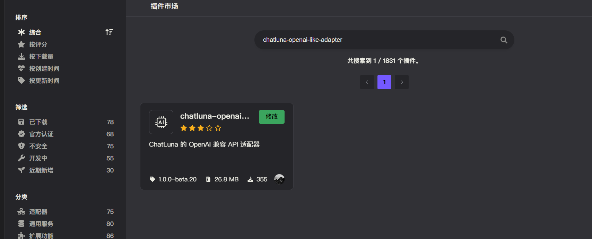
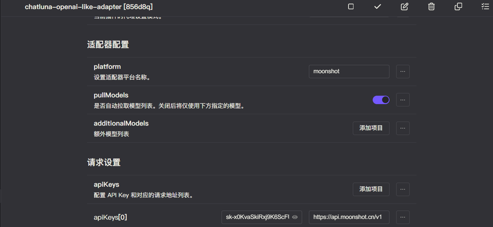
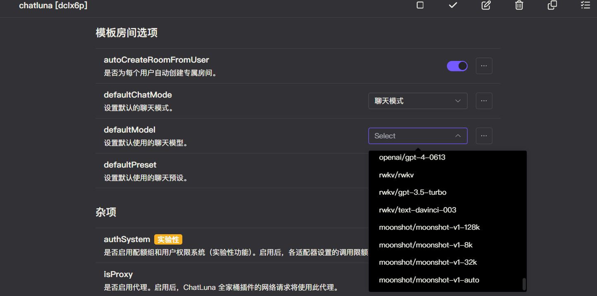

# OpenAI Like

ChatLuna 为其他任意兼容 OpenAI 格式的 API提供了一个统一的 `openai-like-adapter`。

`openai-like-adapter` 具有以下特性：

- 可以设置 `platform` 的名称，并支持同时启用多个模型适配器（只需要确保 `platform` 不同即可。）

## 安装

前往插件市场，搜索 `chatluna-openai-like-adapter`，安装即可。

## 配置

只需要从你的 API 提供商获取 API Key 和 API Host 即可转到下一把

::: tip 提示
未来我们可能会录制官方教程，敬请期待。
:::

获取到 API key 后，转到 `openai-like-adapter` 的配置页面。

在 `openai-like-adapter` 配置页里可以更改平台名，你需要更改为与其他模型适配器都不一样的平台名，防止冲突。
当然，你也可以更改你喜欢的其他平台名。

然后在请求设置里填入你的 API key 和 OpenAI 兼容的请求地址。一般 OpenAI 兼容的格式为 `https://xxx.com/api/v1`。

也就是在调用 OpenAI 库时的 `baseUrl`，但是注意后面需要添加 `v1` 后缀。

记得点击右上角的保存按钮。

## 使用

在适配器的配置页面，点击运行按钮，如无误，你应该看不到任何错误 log，那即可转到 ChatLuna 的主插件页面。

在主插件页面，下划到 [模版房间选项](../useful-configurations.md#模版房间选项)，查看 [defaultModel](../useful-configurations.md#defaultmodel) 的选项里是否含有相关模型，如果有，则说明你已经成功地接入了相关平台。

