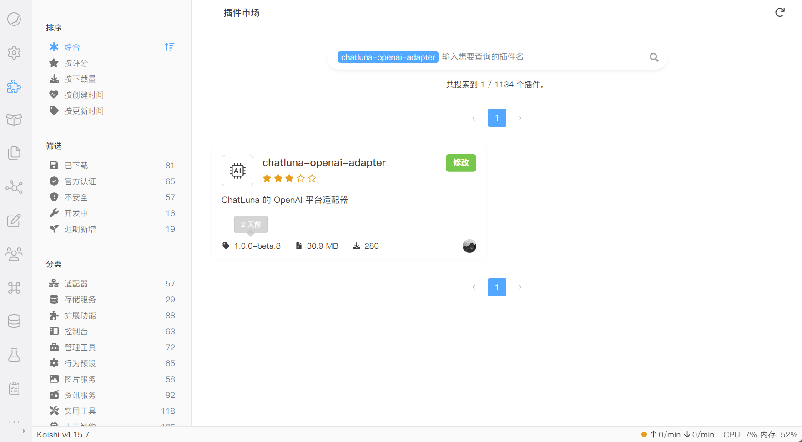

# OpenAI

## 介绍

OpenAI 是目前顶尖的研究大语言模型相关的实验室，旗下同时开放 `gpt-3`,`gpt-3-16k`,`gpt-4` 等模型。

也是 ChatLuna 里最稳定的模型平台适配器。

我们支持对接除了 `gpt-4-vision` 外的所有模型。通过 `v1/models` API 去动态获取模型列表。使得用户无需手动输入模型名称或者等待适配器适配最新的 API。

OpenAI 模型适配器还支持 `plugin` 聊天模式，允许模型调用本地插件工具。

## 安装

前往插件市场，搜索 `chatluna-openai-adapter`，安装即可。

## 配置

在配置之前，请先获取 OpenAI 平台的 `API KEY`。

如使用为其他代理平台（转发接口，API-ADAPTER），还需额外获取 API host 地址。

::: tip 提示
未来我们可能会录制官方教程，敬请期待。
:::

获取到 `API KEY` 后，转到 `openai-adapter` 的配置页面。

默认插件有一个空的适配项，填入你的 `API KEY` 即可。

记得点击右上角的保存按钮。

## 使用

在 OpenAI 适配器的配置页面，点击运行按钮，如无误，你应该看不到任何错误 log，那即可转到 ChatLuna 的主插件页面。

在主插件页面，下划到 [模版房间选项](../useful-configurations.md#模版房间选项)，查看 [defaultModel](../useful-configurations.md#defaultmodel) 的选项里是否含有 OpenAI 模型，如果有，则说明你已经成功地接入了 OpenAI 平台。

## 常见问题

### 1. 国内平台如何接入？

国内平台接入 OpenAI 官方的接口，需要代理设置，前往主插件的配置页面，开启 [代理模式](../useful-configurations.md/#isproxy)，然后配置 [代理地址](../useful-configurations.md#proxyaddress)。
