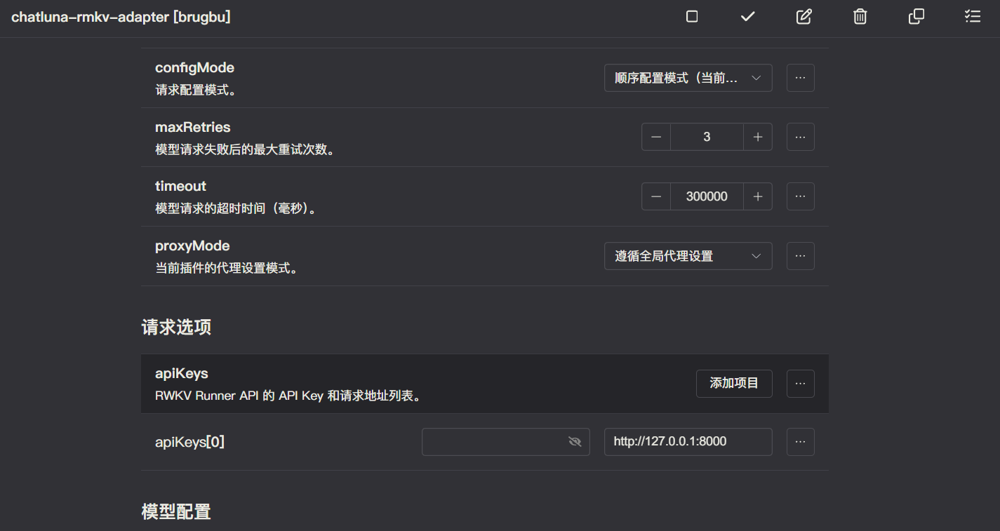
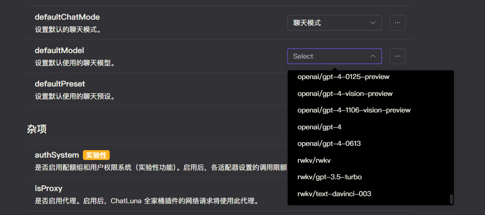

# RWKV

RWKV（Receptance Weighted Key Value）是一种创新的深度学习网络架构，旨在结合RNN（递归神经网络）和Transformer模型的优点。它通过引入Token shift和Channel Mix机制来优化位置编码和多头注意力机制，从而在处理长序列时具有较低的计算复杂度。

目前在开源社区，我们可以使用 [RWKV Runner](https://github.com/josStorer/RWKV-Runner) 或 [ai00_server](https://github.com/Ai00-X/ai00_server) 来运行 RWKV 相关模型。

## 安装

前往插件市场，搜索 `rwkv`，安装即可。

::tip 提示
由于开发者的粗心大意，该插件的全名为 `chatluna-rmkv-adapter`。（错误的键入了 `rwkv`）
如果你在添加新插件时找不到，可以试试搜索 `rmkv`。
::

## 配置

在配置之前，参考上面的项目，选择你喜欢的一个项目来托管 RWKV 的模型运行。

::: tip 提示
未来我们可能会录制官方教程，敬请期待。
:::

确保 RWKV 后端成功运行后，即可转到 RWKV 适配器。

默认插件已经设置了在本地运行的 RWKV Runner 地址，当然你也可以修改为其他地址。

::: tip 提示
对于 `ai00_server`，你可能需要修改为 `http://127.0.0.1:65530/api/oai`。注意 `ai00_server` 的地址需要添加 `api/oai` 后缀。

如果上面的后端你设置了 `api key`，请一并填写到 RWKV 适配器里。默认情况下 `RWKV Runner` 没有设置 `api key`。
:::

设置好后，记得点击右上角的保存按钮。

## 使用

在 RWKV 适配器的配置页面，点击运行按钮，如无误，你应该看不到任何错误 log，那即可转到 ChatLuna 的主插件页面。

在主插件页面，下划到 [模版房间选项](../useful-configurations.md#模版房间选项)，查看 [defaultModel](../useful-configurations.md#defaultmodel) 的选项里是否含有 RWKV 适配器提供的模型，如果有，则说明 RWKV 适配器已经成功的运行。

