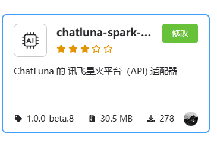
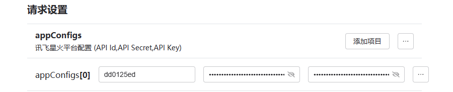

# 讯飞星火

## 介绍

讯飞星火是科大讯飞在 2023 5月宣布推出其认为规模最大、功能最强大的人工智能模型，旗下同时开放 星火1.5,星火2，星火3等模型
是相对于OpenAI适配器最稳定的一个

同时还推出了星火助手，能够让用户获得最好的特定体验

本适配器支持 plugin 聊天模式，能让模型调用本地插件工具，但不是很推荐调用

## 安装

前往插件市场，搜索 `chatluna-spark-adapter`，安装即可

## 配置

在配置之前，请先获取 星火平台的 `APPID  APISecret  APIKey`

::: tip 提示
未来我们可能会录制官方教程，敬请期待。
:::

获取到`APPID APISecret APIKey`后，转到 `spark-adapter `的配置页面

默认插件有一个空的适配项，填入你的 `APPID  APISecret  APIKey` 即可

记得点击右上角的保存按钮

## 使用

在 Spark 适配器的配置页面，点击运行按钮，如无误，你应该看不到任何错误 log，那即可转到 ChatLuna 的主插件页面

在主插件页面，下划到 [模版房间选项](../useful-configurations.md#模版房间选项)，查看 [defaultModel](../useful-configurations.md#defaultmodel) 的选项里是否含有 OpenAI 模型，如果有，则说明你已经成功地接入了 OpenAI 平台。

