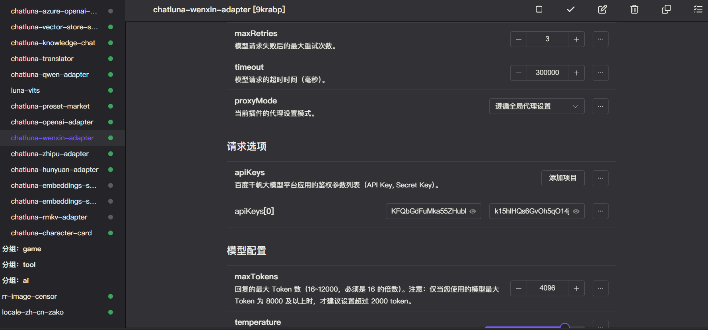
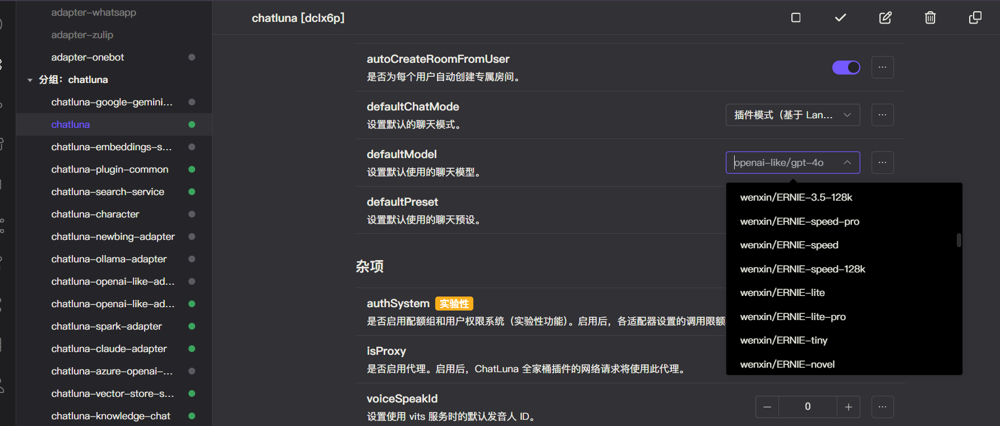

# 文心一言

文心一言是百度推出的一款生成式AI产品，旨在通过大语言模型技术提供智能涌现的计算范式。该产品于2023年3月16日正式发布，并面向个人用户和企业用户开放测试。文心一言在文学创作、商业文案创作、数理推算、中文理解和多模态生成等方面展现了突出的能力。

我们支持对接百度公司提供的大部分可用的文心一言聊天大语言模型或嵌入模型。

由于 API 限制，我们无法获取到文心一言最新可用模型列表，所以当百度公司发布新模型时，我们滞后一段时间才会更新模型列表。

## 安装

前往插件市场，搜索 `chatluna-wenxin-adapter`，安装即可。

## 配置

在配置之前，请先参考 [文心一言API接入指南](https://developer.baidu.com/article/detail.html?id=1089328) 获取 API Key、Secret Key。

::: tip 提示
未来我们可能会录制官方教程，敬请期待。
:::

获取到相关配置后，转到 `wenxin-adapter` 的配置页面。

默认插件有一个空的适配项，填入你的 API key 即可。

记得点击右上角的保存按钮。

## 使用

在文心一言适配器的配置页面，点击运行按钮，如无误，你应该看不到任何错误 log，那即可转到 ChatLuna 的主插件页面。

在主插件页面，下划到 [模版房间选项](../useful-configurations.md#模版房间选项)，查看 [defaultModel](../useful-configurations.md#defaultmodel) 的选项里是否含有 ChatGLM 模型，如果有，则说明 ChatGLM 适配器已经成功的运行。

但我们仍未完全确认文心一言适配器是否可用。

因此我们需要新建一个房间，使用 `chatluna.room.create -m wenxin/ERNIE-lite -p chatgpt -n test-wenxin-adapter` 指令来创建一个使用了文心一言适配器的房间。

然后尝试和模型对话。

只要能正常对话，就说明你成功的连接到了文心一言 API。

别忘了在测试完成后调用 `chatluna.room.delete test-wenxin-adapter` 指令删除测试房间。
