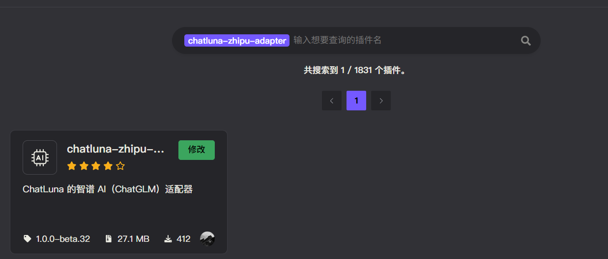
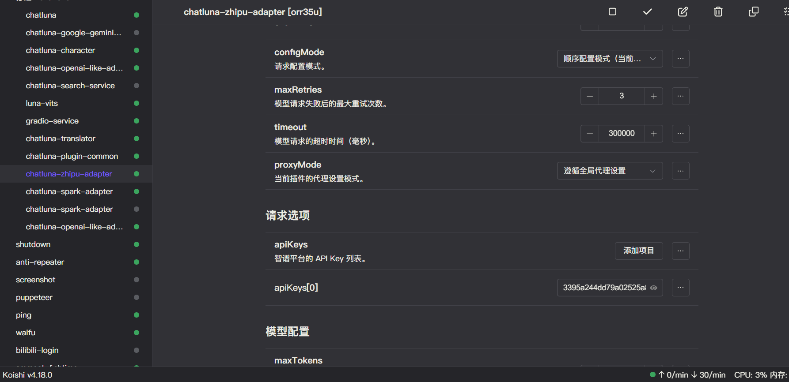

# 智谱 （ChatGLM）

ChatGLM 是一种由清华大学联合智谱AI开发的大型语言模型家族，旨在通过先进的自然语言处理技术提供高效、智能的对话体验。该模型系列包括多个版本，如GLM-4、GLM-4-Air和GLM-4-9B等，这些模型在多语言环境下表现出色，特别是在中文和英文的应用中。

我们支持对接智谱公司提供的大部分可用的聊天大语言模型或嵌入模型。

由于 API 限制，我们无法获取到智谱可用的最新模型列表。

当智谱发布新模型时，我们的模型列表会滞后一段时间更新。

## 安装

前往插件市场，搜索 `chatluna-zhipu-adapter`，安装即可。

## 配置

在配置之前，请先参考 [介绍](https://open.bigmodel.cn/dev/howuse/introduction) 开通 API 服务。并前往[控制台](https://open.bigmodel.cn/usercenter/apikeys) 获取 API key。

::: tip 提示
未来我们可能会录制官方教程，敬请期待。
:::

获取到 API key 后，转到 `zhipu-adapter` 的配置页面。

默认插件有一个空的适配项，填入你的 API key 即可。

记得点击右上角的保存按钮。

## 使用

在智谱适配器的配置页面，点击运行按钮，如无误，你应该看不到任何错误 log，那即可转到 ChatLuna 的主插件页面。

在主插件页面，下划到 [模版房间选项](../useful-configurations.md#模版房间选项)，查看 [defaultModel](../useful-configurations.md#defaultmodel) 的选项里是否含有 ChatGLM 模型，如果有，则说明 ChatGLM 适配器已经成功的运行。

但我们仍未完全确认智谱适配器是否可用。

因此我们需要新建一个房间，使用 `chatluna.room.create -m zhipu/GLM-4-Flash -p chatgpt -n test-zhipu-adapter` 指令来创建一个使用了智谱适配器的房间。

新建房间后请尝试和模型对话。

只要能正常对话，就说明你成功的连接到了智谱 API。

别忘了在测试完成后调用 `chatluna.room.delete test-zhipu-adapter` 指令删除测试房间。
