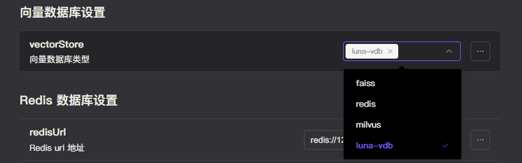

# luna-vdb

luna-vdb 是由 ChatLuna 团队开发的简易，轻量级向量数据库，使用 Rust 编写，并提供 Wasm 支持。

## 安装

luna-vdb 由于其轻量，零依赖的特性，已被向量服务设置为必须依赖。

当你安装了向量服务后，luna-vdb 会自动被安装。

## 使用

1. 安装 `chatluna-vector-store-service`，启用该插件。
2. 在向量适配器中选中 luna-vdb。

   

3. 在主插件的 [模型选项](../useful-configurations.md#模型选项) 中找到 [defaultVectorStore](../useful-configurations.md#defaultvectorstore) 配置项，选择为 `luna-vdb` 即可。
