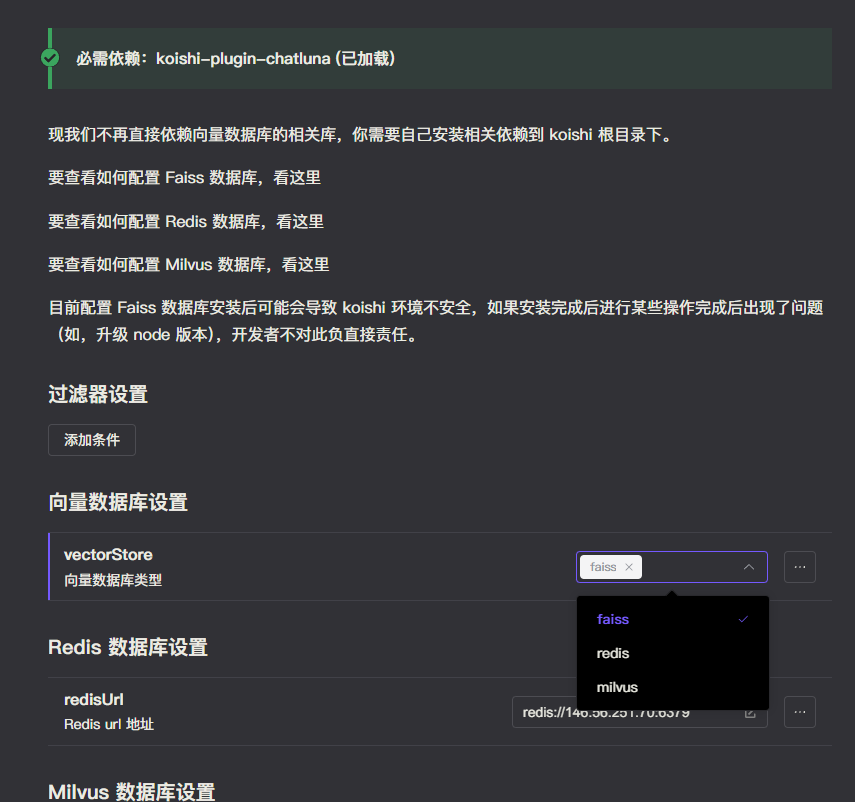

# Milvus

Milvus 是一款高性能、高扩展性的开源向量数据库，专为处理大规模向量数据而设计。它能够存储、索引和管理由深度神经网络和其他机器学习模型生成的海量嵌入向量。Milvus 支持多种数据类型和索引类型，如浮点数、二进制、IVF_FLAT、IVF_SQ8、HNSW、ANNOY 等，使其能够高效地进行向量相似度搜索

## 安装

前往插件市场，搜索并安装 `chatluna-vector-store-service` 即可。注意在安装前，需要先安装 `lancedb` 的依赖。

类似 Faiss，注意 Milvus 的依赖 `@zilliz/milvus2-sdk-node` 被标记为该插件的可选依赖，你需要在启用前安装 `@zilliz/milvus2-sdk-node`。

参考下面的 [Milvus 安装](https://milvus.io/docs/install_standalone-docker-compose.md) 文档，安装 Milvus。

安装完成后，在 `vector-database-service` 中配置 Milvus 连接地址。

## 使用

1. 安装 `chatluna-vector-store-service`，启用该插件。
2. 在向量适配器中选中 milvus。

   

3. 在主插件的 [模型选项](../useful-configurations.md#模型选项) 中找到 [defaultVectorStore](../useful-configurations.md#defaultvectorstore) 配置项，选择为 `milvus` 即可。
