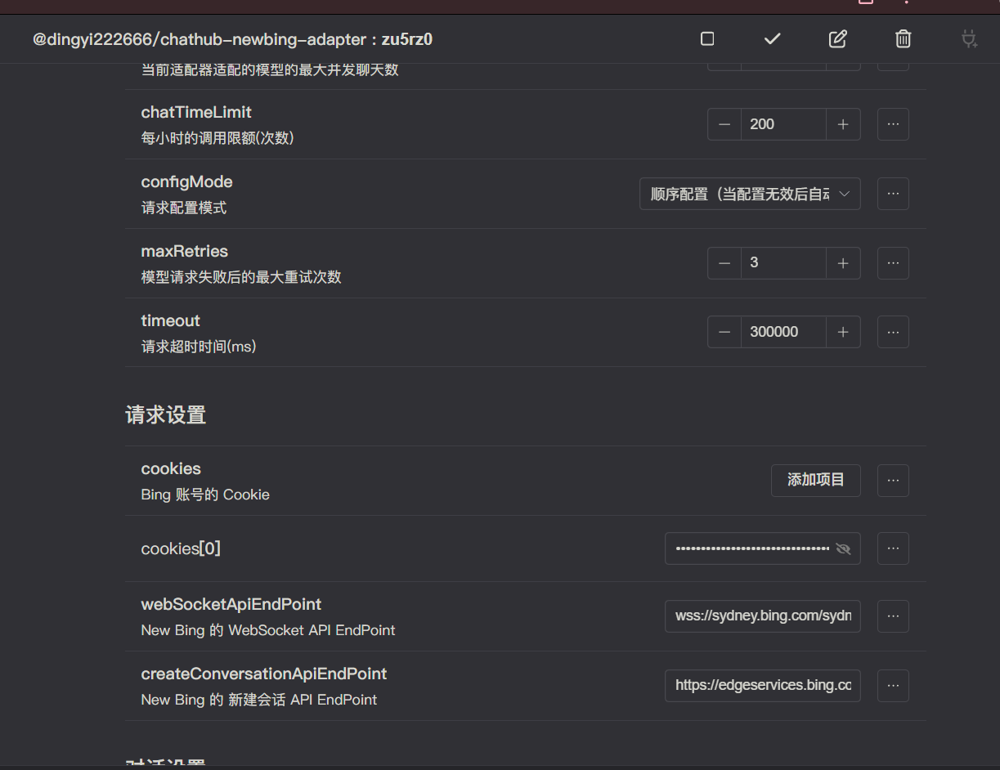

# 快速上手

本节，我们将指导你如何安装与配置 ChatLuna，让你能快速的和模型进行对话。

## 安装 Koishi

在使用 ChatLuna 之前，你需要确保 [Node.js](https://nodejs.org/en) 版本在 v18 以上。

你可以使用 `node -v` 命令检查 Node.js 版本。

按照 [Koishi 官方文档](https://koishi.chat/zh-CN/) 来安装 Koishi。

## 配置聊天平台

安装 Koishi 后，你需要选择一个聊天平台来接入机器人，或使用 [沙盒环境](https://koishi.chat/zh-CN/manual/console/sandbox.html) 测试。

如你选择使用沙盒环境，可以直接跳到 [下一步](/guide/getting-started.html#安装前置依赖插件)。

如你选择接入实际的聊天平台，请参考以下链接：

- [接入其他聊天平台](https://koishi.chat/zh-CN/manual/console/adapter.html)

## 安装前置依赖插件

安装 ChatLuna 的必要前置依赖插件，这些插件为 ChatLuna 提供了基础的服务。

### 数据库插件

ChatLuna 需要 `database` 服务，用于存储会话信息等持久化数据。

我们推荐使用 `database-sqlite`，它自带在大部分 Koishi 环境里，轻量且开箱即用。

你也可以安装并配置其他在 Koishi 插件市场上的数据库插件，如 MySQL、MongoDB 等。

### 缓存插件

ChatLuna 还需要 `cache` 服务，用于存储某些临时配置。

我们推荐使用 `cache-database`，它几乎不需要配置。

### 可选插件

- `puppeteer` 插件：用于渲染模型发送内容。
- `censor` 服务插件：用于回复内容过滤。注意，有的插件不审核文本信息，请注意识别。
- `vits` 服务插件：用于渲染模型回复，生成语音。

## 安装 ChatLuna 主插件

搜索并安装 `@dingyi222666/chatLuna` 插件，这是 ChatLuna 的主插件。
::: warning 注意
主插件本身不包含任何平台适配，后面还需要安装平台适配插件。
:::

## 安装模型适配器

安装你需要平台的模型适配器。在插件市场输入 ChatLuna  + adapter 搜索。然后选择你需要的适配器安装。

你可同时安装多个平台的模型适配器，后续可通过模版房间配置或房间里的模型配置项切换。

## 配置主插件

进入主插件配置页面，以下是一些重要的配置项，其他配置项可在 [配置项](/guide/useful-configurations) 了解到：

- [`isProxy`](/guide/useful-configurations#代理设置)：是否使用代理，对国内用户**强烈推荐**开启。
- [`proxyAddress`](/guide/useful-configurations#代理设置)：代理地址，格式为 `http://host:port`。
- [`outputMode`](/guide/useful-configurations#回复选项)：回复的输出格式，支持语音、文本、图片等。

## 配置模型适配器

以 New Bing 为例，进入模型适配器的插件配置页面：

在 cookies 配置项，点击添加项目，然后填写你[获取](/guild/useful-configurations)来的 cookie。

填写完后右上角保存配置，启用插件即可。

::: warning 注意
如果你在国内环境使用，需要设置代理，请在`ChatLuna`主插件的设置里设置代理(请求设置 -> [`isProxy`](/guide/useful-configurations#代理设置)，请求设置 -> [`proxyAddress`](/guide/useful-configurations#代理设置))。
:::

可以使用 [`chatLuna.model.list`](/guide/useful-commands#模型列表)查看已启用的平台。

## 设置模版房间配置

在控制面板里可设置模版房间的相关配置，如图所示：

设置好模型，聊天模式和预设，右上角保存后即完成配置。

::: tip 提示
对于初次使用 ChatLuna 的新手，我们推荐直接使用模型克隆房间。当你对 ChatLuna 有深入了解后，才推荐使用自定义的房间系统。
:::

## 开始聊天

最后使用 [`chatluna.chat.text`](/guide/useful-commands#模型对话) 命令开始和模型聊天。

通过以上步骤，你已经配置好了 ChatLuna，并且可以和模型聊天了。

接下来你可以在下面的章节学习到更多的配置和使用方法。
