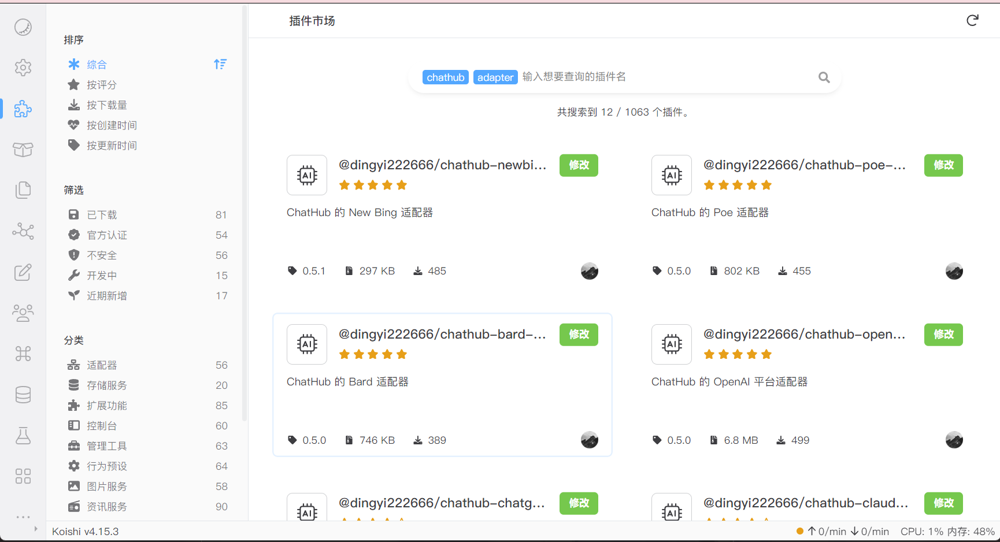

# 快速上手

本节，我们将指导你如何安装与配置 ChatLuna，让你能快速的和模型进行对话。

## 安装 Koishi

在使用 ChatLuna 之前，你需要安装 Koishi。

Koishi 是一个跨平台、可扩展、高性能的聊天机器人框架。ChatLuna 基于 Koishi 框架开发。

按照 [Koishi 官方文档](https://koishi.chat/zh-CN/) 来安装 Koishi。

> [!TIP] 提示
> 社区成员为 Windows 和 Linux 提供了一键安装脚本，该脚本可以一键自动安装 Koishi 以及 ChatLuna。
> 项目地址：https://github.com/hxsyzl/chatluna-install-auto

### 配置聊天平台

安装 Koishi 后，你需要接入一个聊天平台来使用机器人，或在 [沙盒环境](https://koishi.chat/zh-CN/manual/usage/adapter.html#%E5%9C%A8%E6%B2%99%E7%9B%92%E4%B8%AD%E6%A8%A1%E6%8B%9F%E5%AF%B9%E8%AF%9D) 下测试。

如你选择使用沙盒环境，可以直接跳到 [下一步](#安装前置依赖服务)。

如你选择接入实际的聊天平台，请参考 [接入真实聊天平台](https://koishi.chat/zh-CN/manual/usage/adapter.html#%E6%8E%A5%E5%85%A5%E7%9C%9F%E5%AE%9E%E8%81%8A%E5%A4%A9%E5%B9%B3%E5%8F%B0)。

### 安装前置依赖服务

安装 ChatLuna 的必要前置依赖服务，ChatLuna 需要这些服务来提供基础功能。

#### 数据库服务

ChatLuna 需要 `database` 服务，用于存储会话信息等持久化数据。

我们推荐使用 `database-sqlite`，它自带在大部分 Koishi 环境里，已被默认安装并启用。

因此在大部分场景下，你无需额外操作，可直接跳过此小节。

你也可以安装并配置其他在 Koishi 插件市场上的数据库插件，如 MySQL、MongoDB 等。

#### 可选服务

这些服务是为了 ChatLuna 的某些功能而额外需要的服务。你可以根据需要选择安装。

- `censor` 服务：用于回复内容过滤。注意，有的插件不审核文本信息，请注意识别。
- `vits` 服务：用于渲染模型回复，生成语音。

## 安装主插件

搜索并安装 `chatluna` 插件，这是 ChatLuna 的主插件。

::: warning 注意
主插件本身不包含任何模型适配器，无法直接对话。需要参考下面一小节来安装模型适配器。
:::

### 安装模型适配器

安装你需要平台的模型适配器。在插件市场输入 `ChatLuna + <adapter>` 搜索并选择你需要的适配器安装。

你可以同时安装多个平台的模型适配器，后续再根据需要切换其他模型。

## 配置主插件

::: tip 推荐先尝试伪装插件
当你做到这一步时，已经具备使用伪装插件的基础了。

如果你希望获得更灵活、更加拟人的群聊/私聊体验，更推荐尝试 `chatluna-character`（伪装群友）插件。

该插件支持基于预设进行细粒度行为控制，具备自主发送消息等能力，更适合需要角色扮演、群聊风格拟人化的场景。该插件目前相比主插件，仅不支持少量内容（如知识库）。

文档链接：[伪装群友（Character）](/ecosystem/other/character)。
:::

进入主插件配置页面，以下是一些重要的配置项，其他配置项可在 [配置项](/guide/useful-configurations) 了解到：

- [`defaultChatMode`](./useful-configurations.md#defaultchatmode)：默认的聊天模式。支持聊天模式，Agent 模式，浏览模式。
- [`outputMode`](/guide/useful-configurations#回复选项)：回复的输出格式，支持语音、文本、Koishi 元素等。

### 配置模型适配器

参考 [模型平台](./configure-model-platform/introduction.md)，选择你需要配置的模型平台类型。

::: warning 注意
如果你所在的地区无法访问某些模型 API 服务，则需要设置代理。请在 `ChatLuna` 主插件的设置里设置代理(请求设置 -> [`isProxy`](./useful-configurations#isproxy)，请求设置 -> [`proxyAddress`](./useful-configurations#proxyaddress))。
:::

你可以使用 `chatluna.model.list` 查看目前可用的模型。

### 配置默认值

进入 ChatLuna 主插件配置页后，需要设置下面几个参数：

- 默认模型
- 默认预设
- 默认聊天模式

当 ChatLuna 自动创建新会话，或你执行 `chatluna.new` 时，就会使用这些默认值。

::: tip 提示
如果你的网络访问部分模型 API 需要代理，请先在 ChatLuna 的请求设置中配置代理，再进行测试。
:::

## 下一步？

完成上面的步骤后，你已经可以合模型对话了。

你可以直接发送聊天命令，或从预设前缀触发某个预设的对话。

我们更推荐你接着阅读：

- [会话系统](/guide/session-related/conversation)
- [会话指令](/guide/useful-commands/conversation)
