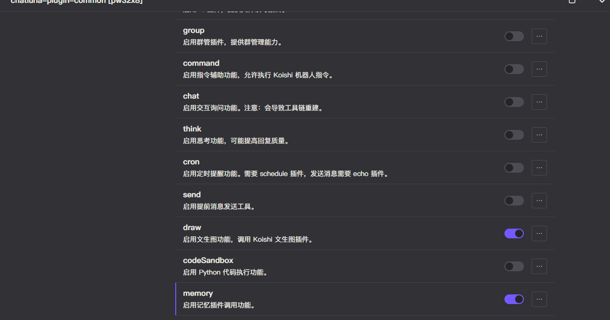

# 主动记忆

相比被动的 [长期记忆](../session-related/long-term-memory.md)，主动记忆工具更偏向于与人类交流般的主动记忆信息。

## 配置

- 在开始之前，确保 [长期记忆](../session-related/long-term-memory.md) 的前置配置已完成。（可以不启用长期记忆）
- 前往 Koishi 的插件市场，搜索 `chatluna-plugin-common`，并安装。
- 按照下图配置在 `plugin-common` 插件中启用 `memory` 功能。

## 测试

尝试和模型对话，让模型记住一些信息。
<chat-panel>
  <chat-message nickname="User">chatluna.chat.text 记住我的生日 1995.11.11</chat-message>
  <chat-message nickname="Bot">
   { 
    &nbsp;&nbsp;tool: 'memory_save', 
    &nbsp;&nbsp;arg: '{"input":"生日是1995年11月11日"}' 
   }
  </chat-message>
  <chat-message nickname="Bot">你的生日是1995年11月11日。</chat-message>
  <chat-message nickname="User">chatluna.room.clear</chat-message>
  <chat-message nickname="Bot">已清除房间 User 的房间 的聊天记录。</chat-message>
  <chat-message nickname="User">chatluna.chat.text 我的生日是什么时候</chat-message>
  <chat-message nickname="Bot">
   { 
    &nbsp;&nbsp;tool: 'memory_search', 
    &nbsp;&nbsp;arg: '{"input":"birthday"}' 
   }
  </chat-message>
  <chat-message nickname="Bot">你的生日是1995年11月11日。</chat-message>
</chat-panel>
