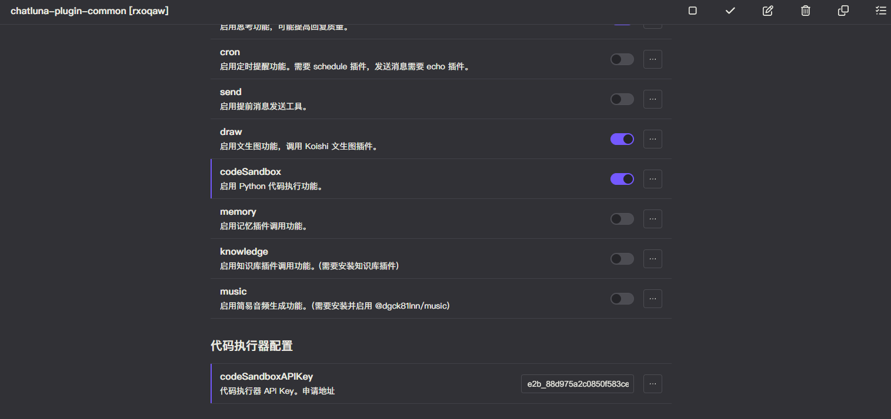
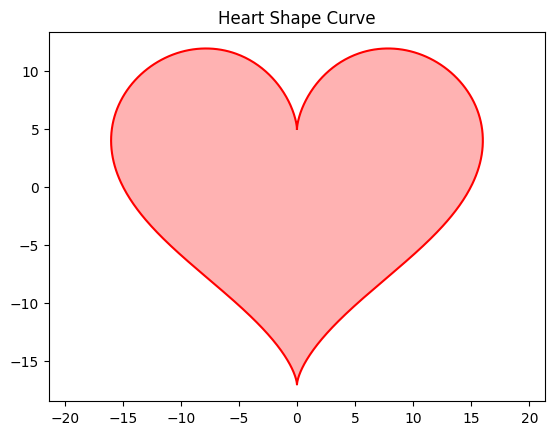

# 代码执行

此工具基于 [e2b.dev](https://e2b.dev/) 提供 Python 代码执行服务。

可以使用模型执行一些 Python 代码，并返回代码执行结果。支持 matplotlib 绘图。

::: tip 提示
由于 Koishi API 限制，我们还不能实现文件的上传下载分析。
:::

## 配置

- 前往 Koishi 的插件市场，搜索 `chatluna-plugin-common`，并安装。
- 按照下图配置在 `plugin-common` 插件中启用 `codeSandbox` 功能。并在 `codeSandboxAPIKey` 中填写你的 e2b.dev API Key。

## 测试

尝试询问模型执行一些 Python 代码，并返回代码执行结果。

<chat-panel>
  <chat-message nickname="User">chatluna.chat.text 绘制一个爱心曲线</chat-message>
  <chat-message nickname="Bot">
   { 
    &nbsp;&nbsp;tool: 'code', 
    &nbsp;&nbsp;arg: '{"code":"import matplotlib.pyplot as plt\nimport numpy as np\n\nt = np.linspace(0, 2 * np.pi, 1000)\nx = 16 * np.sin(t)**3\ny = 13 * np.cos(t) - 5 * np.cos(2 * t) - 2 * np.cos(3 * t) - np.cos(4 * t)\n\nplt.plot(x, y, color=\'red\')\nplt.fill(x, y, \'red\', alpha=0.3)\nplt.title(\'Heart Shape Curve\')\nplt.axis(\'equal\')\nplt.show()"}' 
  }
  </chat-message>
  <chat-message nickname="Bot"></chat-message>
  <chat-message nickname="Bot">喵~这是你要的爱心曲线，主人~！✨</chat-message>
</chat-panel>
