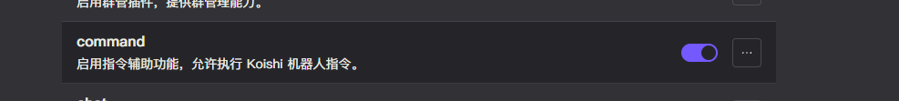
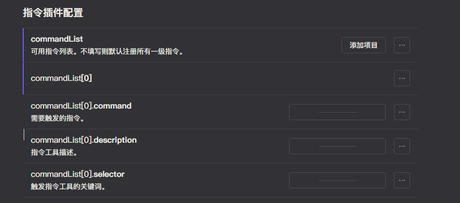

# 命令执行

此工具可以让模型调用当前 Koishi 实例上的 [命令](https://koishi.chat/zh-CN/manual/usage/command.html)。

我们会智能转换 Koishi 命令的参数，提供给模型调用。

## 配置

- 参考 [介绍](introduction.md) 中的配置方法，启用 `plugin-common` 插件。
- 按照下图配置在 `plugin-common` 插件中启用 `command` 功能。

目前 `command` 功能支持两种配置方式：

### 默认

自动转换所有可用指令为模型工具，无需手动配置。但存在以下缺点：

- 太多的命令可能导致模型不支持。
- 无法设置模型工具的触发词。

当你的 Koishi 实例上命令不多时，可以使用此方式。否则请使用手动添加指令的方式。

### 手动添加指令

在 `plugin-common` 插件中开启 `command` 功能后，下滑就可以找到手动配置的选项数组。

可以往数组里添加你指定的指令。每个指令都需要配置三个选项，让我们来逐一介绍。

- `command`: 触发的指令全名，必填参数。填写的指令不需要包含前缀参数，支持多级指令。
- `description`: 指令的描述。描述这个指令的具体作用。不填写时，则会使用指令默认的描述。
- `selector`: 模型工具的触发词。当你的聊天内容含有这些词语时，这个指令对应的模型工具将会被激活。（可选项）

## 测试

可以参考如下配置，添加一个 `status` 指令到命令列表中。

询问模型调用工具，当模型回复相关信息时，说明命令执行工具配置成功。

<chat-panel>
  <chat-message nickname="User">chatluna.chat.text 调用工具获取当前状态信息</chat-message>
  <chat-message nickname="Bot">
    { 
      &nbsp;&nbsp;&nbsp;&nbsp;tool: 'status', 
      &nbsp;&nbsp;&nbsp;&nbsp;arg: '{}' 
    }
  </chat-message>
  <chat-message nickname="Bot">模型请求执行指令 status，如需同意，请输入以下字符：FOWFwPTG </chat-message>
  <chat-message nickname="User">FOWFwPTG</chat-message>
  <chat-message nickname="Bot">
   [onebot] xxx 
   =================== 
   CPU 使用率：0% / 12% 
   内存使用率：0% / 49%
  </chat-message>
  <chat-message nickname="Bot">
  当前系统状态信息如下： 
  - CPU 使用率：0% / 12% 
  - 内存使用率：0% / 49%
  </chat-message>
</chat-panel>
