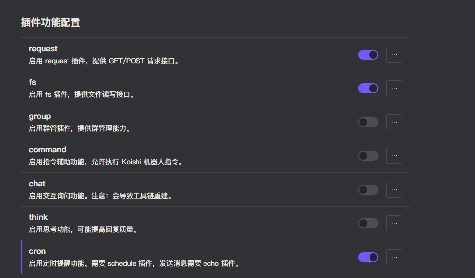

# 定时任务

此工具基于 Koishi 的 [schedule](https://common.koishi.chat/zh-CN/plugins/schedule.html) 插件，提供了定时执行命令的能力，让模型能够创建定时日程。

搭配 [echo](https://koishi.chat/zh-CN/plugins/common/echo.html) 插件，还能实现定时对某人（或自己）发送消息。

## 配置

- 参考 [介绍](introduction.md) 中的配置方法，启用 `plugin-common` 插件。
- 按照下图配置在 `plugin-common` 插件中启用 `cron` 选项。

## 测试

在确保配置了 `cron` 和 `echo` 插件后，询问模型创建一个定时日程，当模型回复创建成功时，说明定时任务工具配置成功。

例如:

<chat-panel>
  <chat-message nickname="User">chatluna.chat.text 一分钟后提醒我看电影</chat-message>
  <chat-message nickname="Bot">
   { 
    &nbsp;&nbsp;tool: 'cron', 
    &nbsp;&nbsp;arg: '{"time":"1m","type":"echo","content":"看电影时间到了！"}' 
  }
  </chat-message>
  <chat-message nickname="Bot">模型请求执行定时指令 schedule 1m -- echo -u @User 看电影时间到了！，如需同意，请输入以下字符：4ekrCsxA</chat-message>
  <chat-message nickname="User">4ekrCsxA</chat-message>
  <chat-message nickname="Bot">已经为你设置了一分钟后的提醒：看电影时间到了！</chat-message>
  
——— 1 分钟后 ———

  <chat-message nickname="Bot">看电影时间到了！</chat-message>
</chat-panel>
