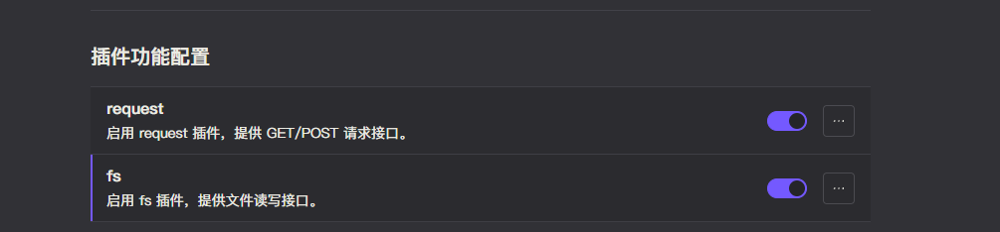

# 文件读写

此工具为模型提供了在本地文件系统中读写文件的能力。

## 配置

- 参考 [介绍](introduction.md) 中的配置方法，启用 `plugin-common` 插件。
- 按照下图配置在 `plugin-common` 插件中启用 `fs` 功能。

## 测试

将当前房间设置为插件模式，然后询问模型阅读文件，当文件阅读内容成功时，则说明工具启用成功。

::: warning 警告
目前文件工具只能阅读纯文本内容，对于二进制文件暂时无法读取！
:::

例如:

<chat-panel>
  <chat-message nickname="User">chatluna.chat.text 阅读 koishi.yml，分析文件内容</chat-message>
  <chat-message nickname="Bot">
   {
    tool: 'read_file',
    arg: '{"input":"koishi.yml"}'
   }
  </chat-message>
   <chat-message nickname="Bot">
    # koishi.yml 文件内容分析

    文件结构:
    - plugins:
      - group: 分组，包含多个插件

    分析各组内容:

    1. **group:server**
       - 包含服务器配置，如 `server:qtdlib` 和 `server-satori` 等。

    2. **group:basic**
       - 基础插件配置，包括 `admin`, `bind`, `commands`, `help`, `http`, `inspect` 等。

    3. **group:console**
       - 控制台相关插件配置，如 `actions`, `analytics`, `auth` 等。

    4. **group:storage**
       - 存储插件配置，包括不同的数据库配置如 `database-mongo`, `database-mysql` 等。

    5. **group:adapter**
       - 适配器配置，如 `adapter-dingtalk`, `adapter-discord`, `adapter-kook` 等。

    6. **osu-funny**
       - osu! API 配置。

    7. **group-manage**
       - 管理插件，如 `blockingRules` 和其他群组管理规则。

    8. **group:mxb5vv**
       - chatluna 配置，主要包括各种 chatluna 相关功能及参数设置。

    9. **group:develop**
       - 开发环境相关插件 `hmr`。

    10. **cache-redis**
        - Redis 缓存配置。

    11. **其他插件**
        - 例如 `shutdown`, `anti-repeater`, `ping`, `waifu` 等。

    12. **prefix**
        - 命令前缀配置。

    13. **logger**
        - 日志级别设置。

    14. **i18n**
        - 国际化配置，支持的语言和输出方式。
        
    总结:
    `koishi.yml` 是一个多功能配置文件，配置了不同分组的插件和其具体的参数设置，从基础功能、适配器、存储到特定服务支持场景如chatluna、osu等。文件详细而系统，分组明确，适用于 `Koishi` 框架管理多种功能。

  </chat-message>
</chat-panel>
