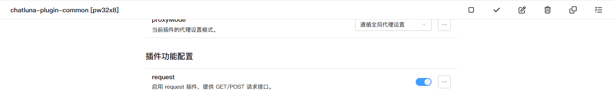

# 网络请求

此工具为模型提供了 HTTP GET 和 POST 请求的能力。

## 配置

- 参考 [介绍](introduction.md) 中的配置方法，启用 plugin-common 插件。
- 开启下图功能即可。

配置了搜索服务插件后，就可以让模型调用网络请求工具了。

## 测试

将当前房间设置为插件模式，然后询问模型请求某个 API，当模型回复的内容包含 API 响应式时，说明网络请求工具配置成功。

例如:

<chat-panel>
  <chat-message nickname="User">chatluna.chat.text 请求 https://v2.jokeapi.dev/joke/Any 给我讲个笑话</chat-message>
  <chat-message nickname="Bot">
    {
      tool: 'requests_get',
      arg: '{"input":"https://v2.jokeapi.dev/joke/Any"}'
    }
  </chat-message>
   <chat-message nickname="Bot">
    Why did the programmer jump on the table?  
    Because debug was on his screen.
  </chat-message>
</chat-panel>
