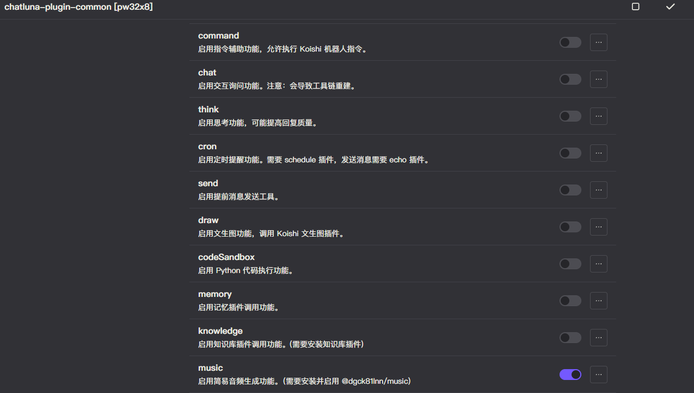

# 简易音频生成

此工具基于 [@dgck81lnn/music](https://github.com/DGCK81LNN/koishi-plugin-music)，提供一个简易的音频生成功能。

## 配置

- 前往 Koishi 插件市场安装 [@dgck81lnn/music](https://github.com/DGCK81LNN/koishi-plugin-music) 插件。
- 在 `plugin-common` 插件中启用 `music` 功能。

## 测试

尝试和模型对话，让它生成一段音频。如果成功返回了音频，则说明配置成功。

<chat-panel>
  <chat-message nickname="User">chatluna.chat.text 生成欢乐颂旋律的前 15 秒</chat-message>
  <chat-message nickname="Bot">
   { 
    &nbsp;&nbsp;tool: 'music', 
    &nbsp;&nbsp;arg: '{"input":"bpm = 120;\nbaseFrequency = 440;\ngain = 0.5;\n\ntime = 0;\nnote(0, 0.75); note(0, 0.75); note(2, 0.75); note(4, 0.75);\nnote(4, 0.75); note(2, 0.75); note(0, 0.75); note(-1, 0.75);\nnote(-3, 1.5);\nrest(0.5);\nnote(4, 0.75); note(4, 0.75); note(2, 0.75); note(0, 0.75);\nnote(-1, 0.75); note(0, 1.5);\nrest(0.5);\nnote(2, 1.5); note(4, 1.5);\nnote(4, 1.5); note(2, 1.5);\nnote(0, 1.5);\nrest(0.5);\n"}' 
  }
  </chat-message>
  <chat-message nickname="Bot">[假装是一条音频]</chat-message>
  <chat-message nickname="Bot">如下是旋律的前15秒钟：
bpm = 120;
baseFrequency = 440;
gain = 0.5;

time = 0;
note(0, 0.75); note(0, 0.75); note(2, 0.75); note(4, 0.75);
note(4, 0.75); note(2, 0.75); note(0, 0.75); note(-1, 0.75);
note(-3, 1.5);
rest(0.5);
note(4, 0.75); note(4, 0.75); note(2, 0.75); note(0, 0.75);
note(-1, 0.75); note(0, 1.5);
rest(0.5);
note(2, 1.5); note(4, 1.5);
note(4, 1.5); note(2, 1.5);
note(0, 1.5);
rest(0.5);
  </chat-message>
</chat-panel>
