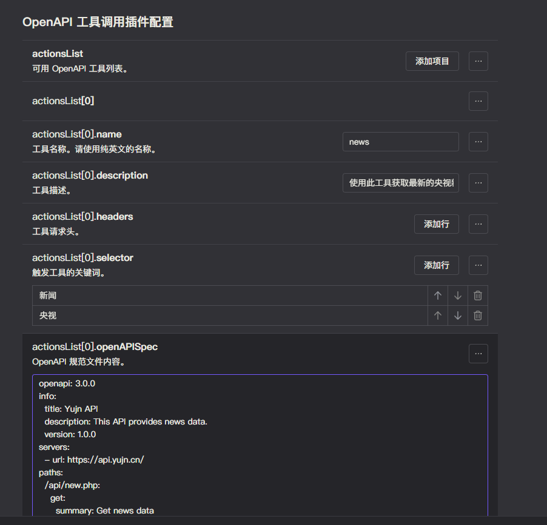

# 任意 API 请求

此工具会将 OpenAPI 规范转换为模型工具。使得模型可以调用工具请求外部的 API。

## 配置

- 参考 [介绍](introduction.md) 中的配置方法，启用 `plugin-common` 插件。
- 按照下图配置在 `plugin-common` 插件中启用 `action` 功能。


- 完成后，还需要参考下图在 `plugin-common` 插件中配置 `action` 功能。



由上图，我们能知道在 `action` 功能中，我们可以添加任意的 API 请求。

分为以下几个部分：

- `name`: 工具的名称。
- `description`: 工具的描述。
- `headers`: 请求头。用于某些需要认证的 API。
- `selector`: 模型工具的触发词。当你的聊天内容含有这些词语时，这个指令对应的模型工具将会被激活。（可选项）
- `openAPISpec`: OpenAPI 格式文件。用于指定 API 的请求方式、参数等信息。

配置完以下几个部分后，我们就可以让模型调用任意的 API 了。

## 测试

可以参考下面的 OpenAPI 格式文件，添加一个新闻查询工具。

::: details news.yml

```yaml
openapi: 3.0.0
info:
  title: Yujn API
  description: This API provides news data.
  version: 1.0.0
servers:
  - url: https://api.yujn.cn/
paths:
  /api/new.php:
    get:
      summary: Get news data
      description: Returns a list of news articles.
      parameters:
        - in: query
          name: count
          schema:
            type: integer
          description: Number of results to return
      responses:
        '200':
          description: Successful response
          content:
            application/json:
              schema:
                type: object
                properties:
                  code:
                    type: integer
                    description: Response code
                  count:
                    type: integer
                    description: Number of returned results
                  data:
                    type: array
                    items:
                      type: object
                      properties:
                        time:
                          type: string
                          description: News publication time
                        title:
                          type: string
                          description: News title
                        brief:
                          type: string
                          description: News brief
                        image:
                          type: string
                          description: Image URL
                        url:
                          type: string
                          description: News URL
```
:::

询问模型调用工具，当模型回复相关信息时，说明命令执行工具配置成功。

<chat-panel>
  <chat-message nickname="User">chatluna chat text tell me the last news</chat-message>
  <chat-message nickname="Bot">
    {<br>
        &nbsp;&nbsp;&nbsp;&nbsp;tool: 'gzdlte',<br>
        &nbsp;&nbsp;&nbsp;&nbsp;arg: '{<br>
        &nbsp;&nbsp;&nbsp;&nbsp;&nbsp;&nbsp;"query": {<br>
        &nbsp;&nbsp;&nbsp;&nbsp;&nbsp;&nbsp;&nbsp;&nbsp;"count": "5"<br>
        &nbsp;&nbsp;&nbsp;&nbsp;&nbsp;&nbsp;}<br>
        &nbsp;&nbsp;&nbsp;&nbsp;}',<br>
        &nbsp;&nbsp;&nbsp;&nbsp;log: 'Invoking "gzdlte" with {"query":{"count":"5"}}'<br>
    }
  </chat-message>
  <chat-message nickname="Bot">
1. 刚果（金）反政府武装单方面宣布从2月4日起停火<br>
    时间: 2025-02-04 04:54:14<br>
    简介: The M23 movement in the Democratic Republic of Congo has unilaterally announced a ceasefire starting February 4 for humanitarian reasons.<br>
    <br>
    <a href="https://news.cctv.com/2025/02/04/ARTI8isYE4eBQYAmXR5cHHVO250204.shtml">阅读更多</a><br><br>

2. 美国民调：大多数美国人反对实施新的加征关税措施<br>
    时间: 2025-02-04 04:53:49<br>
    简介: A recent poll indicates that most Americans oppose new tariffs on Mexico and Canada.<br>
    <br>
    <a href="https://news.cctv.com/2025/02/04/ARTIjgY4DR9hdPHOs4j5Ylru250204.shtml">阅读更多</a><br><br>

3. 首次成功尝试！"中山大学极地"号在渤海冰区完成星-机-船协同观测<br>
    时间: 2025-02-04 04:51:21<br>
    简介: The Zhongshan University Polar vessel successfully completed a collaborative observation in the Bohai Sea ice region, marking a first in the Northern Hemisphere's lowest latitude sea ice area.<br>
    <br>
    <a href="https://news.cctv.com/2025/02/04/ARTI5P6bm2xr5Au7DNnHMzIg250204.shtml">阅读更多</a><br><br>

4. 目前仍处于流感季节性流行期 肺炎是流感最常见的并发症<br>
    时间: 2025-02-04 04:43:18<br>
    简介: During the peak of flu season, pneumonia remains the most common complication; timely treatment is advised within 48 hours of diagnosis.<br>
    <br>
    <a href="https://news.cctv.com/2025/02/04/ARTITvm8XFCaCLZxwgQj7sMm250204.shtml">阅读更多</a><br><br>

5. 新春走基层｜立春日，返岗专列奔赴新程<br>
    时间: 2025-02-04 04:30:47<br>
    简介: On the day of the Spring Festival, workers in Guangdong are returning to their jobs, highlighting family and education convenience.<br>
    <br>
    <a href="https://news.cctv.com/2025/02/04/ARTIX3LletsvnqYLceYeELvn250204.shtml">阅读更多</a>
  </chat-message>
</chat-panel>
