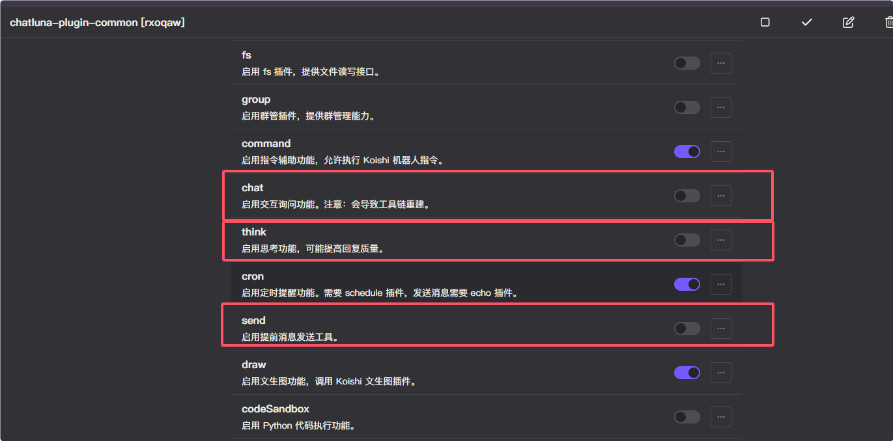

# 思考工具

思考工具提供了一系列工具，方便模型和用户进行交流和思考。

## 配置

前往 Koishi 的插件市场，搜索 `chatluna-plugin-common`，并安装。

选择性的开启下面的工具即可:

## 测试

尝试询问模型一些深度问题，可以看到回答准确度有所提升。

<chat-panel>
  <chat-message nickname="User">chatluna.chat.text 调用思考工具思考: 6.11 和 6.9 哪个大</chat-message>
  <chat-message nickname="Bot">
   { 
    &nbsp;&nbsp;tool: 'think', 
    &nbsp;&nbsp;arg: '{"input":"比较6.11和6.9哪个数值更大"}' 
  }
  </chat-message>
  <chat-message nickname="Bot">经过仔细思考和比较：  6.11 和 6.9 的整数部分都是 6。 但 0.11（6.11的十进制部分） 小于 0.9（6.9的十进制部分）。 所以，6.11 小于 6.9。</chat-message>
</chat-panel>
