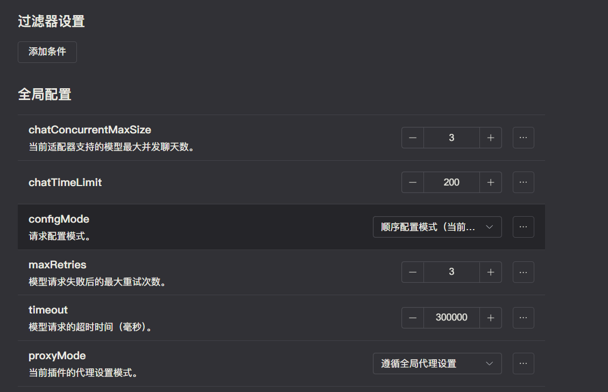
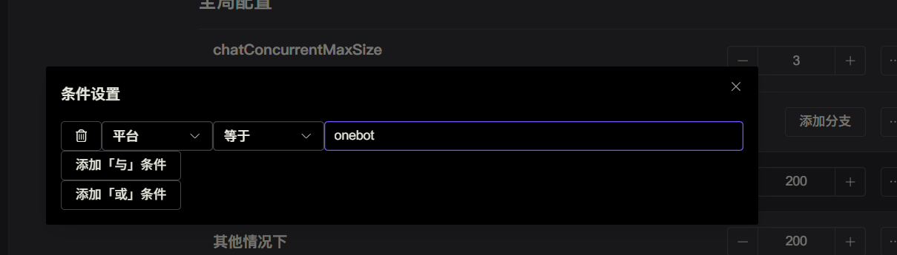
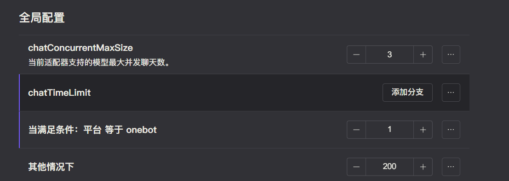
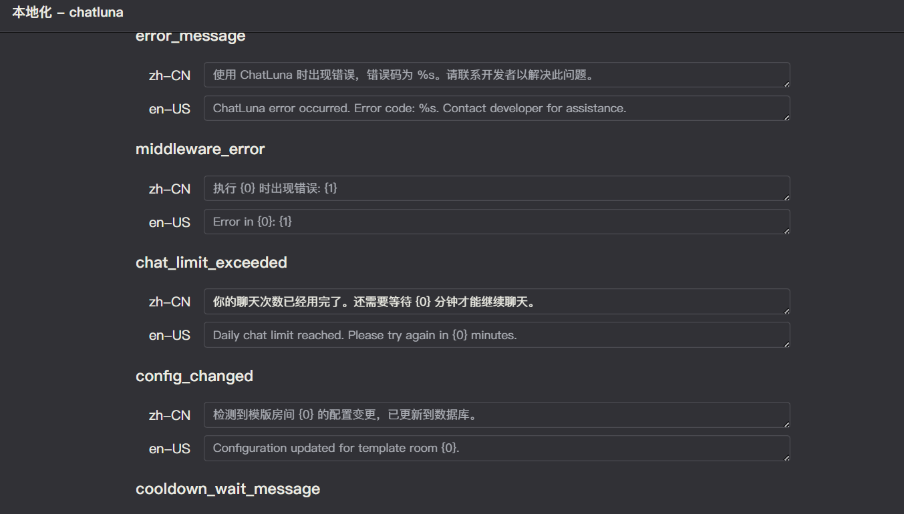

# 聊天限额

类似 [黑名单](./blacklist.md)，聊天限额也是基于 Koishi 的条件属性实现的。

不同的是，聊天限额的配置界面在每个 「模型适配器」 的配置界面中。这意味你可以分别为不同的平台设置不同的聊天限额。

聊天限额采用按小时可用的聊天次数来计算，当超过限额时，会返回限额文本，并提醒在下一个小时后重置。

## 配置

每个「模型适配器」 的配置界面中，在顶上就可以看到 「聊天限额」 的配置项。（即为 「chatLimit」 配置项）

如果不添加分支，则代表所有人每小时最多可用的聊天次数，默认为 200 次。

我们可以添加一个分支，选择一个条件属性，例如 「用户名」 或 「用户 ID」，然后设置每小时最多可用的聊天次数。

设置好条件之后，在右边的数字框中输入每小时最多可用的聊天次数。

## 测试

类似 [黑名单](./blacklist.md)，聊天限额也需要实际测试来验证是否生效。

我们可以设置一个条件（比如设置自己的聊天次数为 1），然后聊天多次，查看是否生效。

生效后，则会返回类似这样的限额文本。则说明聊天限额生效了。

<chat-panel>
  <chat-message nickname="10001">chatluna.chat.text Hello</chat-message>
  <chat-message nickname="Bot">你的聊天次数已经用完了喵，还需要等待 60 分钟才能继续聊天喵</chat-message>
 </chat-panel>

## 本地化

ChatLuna 默认提供了中英两种语言的支持。当然你也可以在 Koishi 控制面板的本地化中自行修改限额文本。

我们可以修改成 「你的聊天次数已经用完了。还需要等待 {0} 分钟才能继续聊天。」，然后重新试试触发限额文本。

<chat-panel>
  <chat-message nickname="10001">chatluna.chat.text Hello</chat-message>
  <chat-message nickname="Bot">你的聊天次数已经用完了。还需要等待 60 分钟才能继续聊天。</chat-message>
 </chat-panel>

 这时候就会返回修改后了的限额文本。
