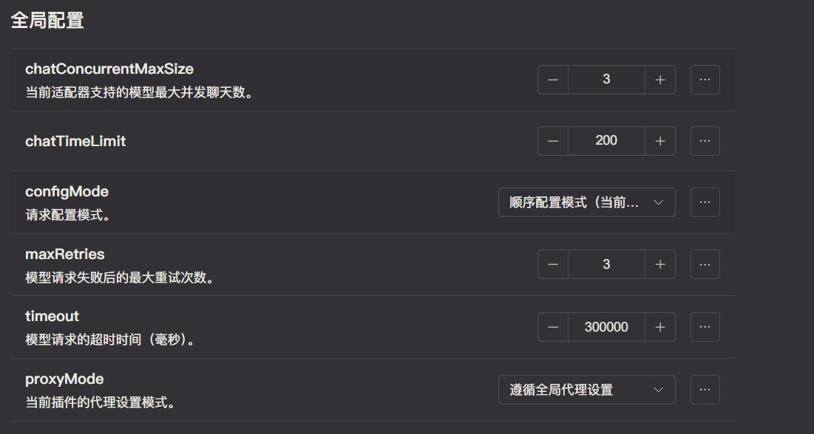

# 并发限制和重试

在每个 ChatLuna 的「模型适配器」的配置界面中，除了聊天限额，还额外可以配置 「并发限制」、「重试」等。

## 并发限制

并发限制是指在同一时间，最多允许多少个请求同时发出，默认值为 1。

当并发限制为 1 时，只有 1 个请求可以被发出，其他请求需要等待。

## 错误重试

错误重试代指为上面的「最大重试次数」，当模型请求失败后进行重试的次数。默认值为 3。

当设置的值为 3 时，当请求模型失败后，将会重新发出请求，如此循环 3 次直到成功。当循环后仍未成功响应时将会输出 API 请求错误码。

## 超时时间

超时时间是指请求模型的最大超时时间，默认值为 300000（毫秒）。当超过设置值后仍未成功响应时将会输出 API 请求错误码。

## 代理设置

每个 「模型适配器」还可以额外设置代理，目前可以设置三种模式：

- 禁用代理：不遵循 ChatLuna 主插件的代理设置，直接请求
- 遵循全局代理设置：遵循 ChatLuna 主插件的代理设置（不是系统全局的代理设置！！！）
- 使用自定义代理：可以设置其他的代理服务器地址。
