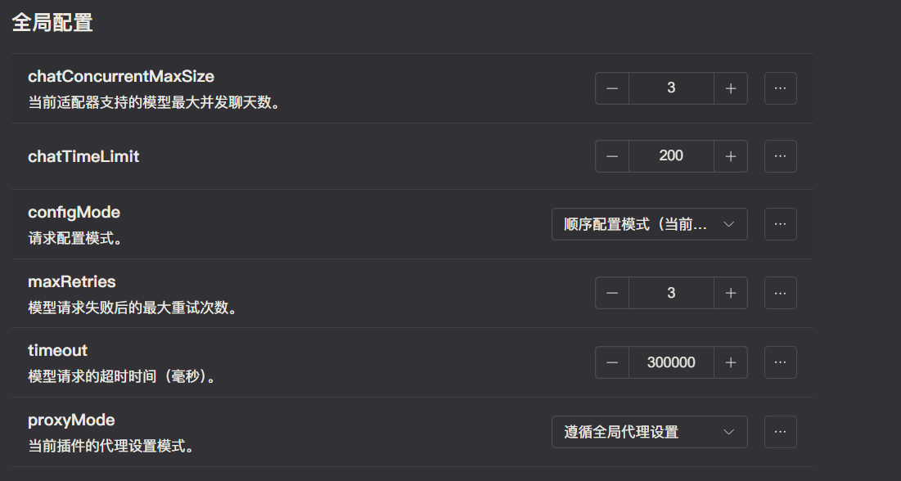

# 并发限制和重试

模型适配器提供了并发限制、最大重试次数、超时时间和代理等配置项。这些配置不影响模型的回复质量，但直接关系到请求的稳定性。

## 并发限制

并发限制控制同一时间最多允许发出的请求数量，默认值通常为 `1`。

值越小，整体越稳定；值越大，吞吐越高，但更容易触发上游 API 限流或代理拥堵。

当设置的值为 `1` 时，适用于以下场景：

- 模型平台本身限流较严
- 使用了不太稳定的代理
- 群内偶尔出现并发消息，但量不大

此配置下，请求会排队处理，速度较慢但更稳定。

如果满足以下条件，可以将并发限制提高到 `2` 或 `3`：

- 上游模型平台并发承受能力较好
- 代理稳定
- 机器人经常在多个群或多个会话中同时收到请求

假设并发限制为 `1`：A 发送消息后 B 紧跟着发送，B 的请求会等 A 处理完毕后才发出。

假设并发限制为 `3`：A、B、C 三条请求可以同时发出，回复更快，但也更容易遇到限流或超时。

## 错误重试

最大重试次数控制一次请求失败后的补充尝试次数，默认值一般为 `3`。

### 适用场景

错误重试主要用于处理临时性故障：

- 网络抖动
- 代理偶发失败
- 上游 API 返回 5xx 错误
- 限流擦边，重试即可通过

### 示例

假设最大重试次数为 `3`：第一次请求失败后，ChatLuna 会再尝试最多 3 次。如果全部失败，才会将错误抛出。

### 建议

- 经常遇到临时网络问题时，保留 `2` 到 `3` 次重试
- 如果失败原因是配置错误（如 API Key 错误、模型名错误），增加重试次数没有意义
- 上游平台限流严格时，过高的重试次数只会延长等待时间

## 超时时间

超时时间控制单次请求的最长等待时间，默认值通常为 `300000` 毫秒（5 分钟）。超过该时间仍未返回结果，请求将按超时处理。

以下场景可以考虑增大超时时间：

- 使用响应较慢的大模型
- 经常执行长推理、长上下文任务
- 代理本身会带来明显延迟

但需要注意，超时时间过长会带来以下问题：

- 一条失败请求会长时间占用资源
- 并发位被持续占用
- 用户会以为机器人无响应，实际只是尚未超时。

假设超时时间为 60 秒：45 秒返回则正常成功，超过 60 秒未返回则按超时失败处理。

对于长任务，60 秒可能偏短；对于普通聊天，默认的 5 分钟通常足够。

## 代理设置

每个模型适配器可以单独配置代理，支持以下三种模式：

- 禁用代理：不使用任何代理，直接请求。适用于模型平台本身可以直连的情况。
- 遵循全局代理设置：跟随 ChatLuna 主插件的代理配置。适用于多个模型平台使用同一套代理的情况。
- 使用自定义代理：为该适配器单独指定代理地址。适用于不同平台需要不同代理，或需要对特定适配器进行调试的情况。
